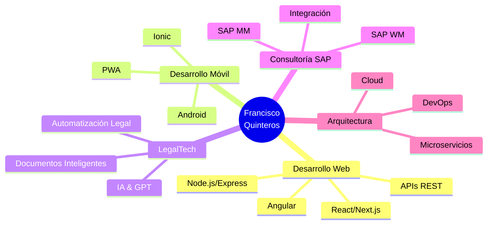

<div align="center">
  
<!-- Banner animado -->


<!-- Typing animation -->
<p align="center">
  
</p>

<!-- Badges de perfil -->
<p align="center">
  
  
  
  
</p>

</div>

---

## Sobre mí

```typescript
const franciscoQuinteros = {
    ubicación: "Ecuador",
    trabajoActual: "Ingeniero en software, Fullstack Developer & Abogado",
    código: ["JavaScript", "TypeScript", "Python", "Java"],
    experiencia: {
        fullstack: ["React", "Angular", "Next.js", "Node.js", "Express", "NestJS"],
        mobile: ["Ionic", "Android Studio", "React Native", "Expo"],
        backend: ["FastAPI", "Flask", "Spring Boot", "Fastify"],
        databases: ["PostgreSQL", "MySQL", "Firebase", "SQLite"],
        cloud: ["Docker", "GitHub Actions"],
        legalTech: ["Automatización Legal", "GPT APIs", "Vosk AI"],
        sap: ["SAP MM", "SAP WM"]
    },
    arquitectura: ["REST APIs", "Microservicios", "SPA", "PWA"],
    desafíoActual: "Construir soluciones tecnológicas que simplifiquen procesos legales",
    pasiones: ["Innovación Legal", "Código Limpio", "Open Source", "Automatización"],
    quote: "El código es poesía, el software es arte"
};
```

<div align="center">
  
### Lo que hago

**Desarrollo Fullstack** con tecnologías modernas y escalables  
**LegalTech Innovation** - Automatización de procesos legales  
**Consultoría SAP** en módulos MM (Gestión de Materiales) y WM (Work Managament)  
**Arquitectura de Software** - Diseño de sistemas robustos y mantenibles  
**Integración de IA** - Implementación de soluciones con GPT y reconocimiento de voz

</div>

---

## Stack Tecnológico

<div align="center">

### Frontend Development


### Backend Development


### Mobile Development


### Databases & Cloud


### Build Tools & Module Bundlers


### DevOps & Tools


### Testing & Quality


### Real-time & Communication


### UI Libraries & Tools


### Utilities & CLI


### LegalTech & Automation


### Design & Collaboration


### ERP & Business


</div>

---

## Estadísticas de GitHub

<div align="center">
  


</div>

<div align="center">


</div>

---

## Experiencia Destacada

<table>
<tr>
<td width="50%">

### Desarrollo Fullstack
- Aplicaciones web escalables con React/Next.js
- APIs REST robustas con Node.js/Express/NestJS
- Sistemas empresariales con Angular
- Arquitecturas de microservicios
- Integración de bases de datos relacionales

</td>
<td width="50%">

### LegalTech & Automatización (En Aprendizaje constante)
- Automatización de procesos legales
- Generación automática de documentos
- Chatbots con IA para consultas legales
- Reconocimiento de voz (Vosk AI)
- Integración GPT para análisis legal

</td>
</tr>
<tr>
<td width="50%">

### Consultoría SAP
- Implementación SAP MM (Gestión de Materiales)
- Configuración SAP WM (Warehouse Management)
- Optimización de procesos logísticos
- Capacitación y soporte técnico
- Integración con sistemas externos
- Aprendizaje constante en ABAP CLOUD

</td>
<td width="50%">

### Desarrollo Móvil
- Apps híbridas con Ionic Framework
- Desarrollo nativo Android
- React Native & Expo
- PWAs (Progressive Web Apps)
- Sincronización offline-first

</td>
</tr>
</table>

---

## Proyectos Destacados

<div align="center">

[](https://portfolio-five-gilt-51.vercel.app/)

</div>

<table width="100%">
<tr>
<td width="50%" valign="top">

### LegalTech Automation Platform
Plataforma de automatización para despachos legales con:
- Generación automática de contratos
- Transcripción de audiencias con IA
- Dashboard de gestión de casos
- Firma electrónica integrada

**Tech:** React, FastAPI, PostgreSQL, OpenAI API, Vosk


</td>
<td width="50%" valign="top">

### TecnoAuto - ERP Automotriz
Sistema integral de gestión para talleres automotrices:
- Órdenes de servicio y facturación SRI
- Control de roles y flujos operativos
- Gestión de inventario
- Reportes y analytics

**Tech:** Angular, TypeScript, NestJS, PostgreSQL, Tailwind


</td>
</tr>
<tr>
<td width="50%" valign="top">

### Chat App
Aplicación de mensajería en tiempo real:
- Comunicación instantánea
- Gestión de eventos
- Interface responsiva
- Estado persistente

**Tech:** React, Redux, Socket.io, Node.js, Formik


</td>
<td width="50%" valign="top">

### Gym Pro - Fitness App
Aplicación móvil para gestión de entrenamientos:
- Rutinas personalizadas
- Seguimiento de métricas
- Panel administrativo completo
- Notificaciones push

**Tech:** React Native, Expo, TypeScript, Node.js, PostgreSQL


</td>
</tr>
</table>

---

## Formación & Certificaciones

<div align="center">

| Título | Institución | Año |
|:---:|:---:|:---:|
| Ingeniería en Software | Universidad UNIANDES | 2025 |
| Abogado | Universidad Católica de Cuenca | 2015 |
| SAP MM/WM Consultant | SAP - Udemy - Logali Group | 2018-2025 |
| Full stack Developer | Códica LA| 2025 |

</div>

---

## Servicios Profesionales

<div align="center">



</div>

### Estoy disponible para:

<table>
<tr>
<td>

- **Desarrollo de MVPs** - Lleva tu idea al mercado rápidamente
- **Proyectos Empresariales** - Soluciones a medida para tu negocio
- **Automatización Legal** - Optimiza tus procesos legales
- **Consultoría SAP** - Mejora tu gestión logística
- **Mentoría Tech** - Comparto mi experiencia

</td>
<td>

- **Mantenimiento de Apps** - Soporte y mejoras continuas
- **Integración de APIs** - Conecta tus sistemas
- **Apps Móviles** - Desde la idea hasta la tienda
- **Soluciones con IA** - Integración de modelos GPT
- **Consultoría Técnica** - Orientación en decisiones tech

</td>
</tr>
</table>

---

## Conectemos

<div align="center">

[](https://portfolio-five-gilt-51.vercel.app/)
[](mailto:javierquiandra@gmail.com)
[](https://www.instagram.com/quinan_dev?igsh=MTB5ZG8zdHFlZm52cw==)
[](https://www.linkedin.com/in/francisco-quinteros-583132152)
[](https://github.com/JavierQuinan)

</div>

<div align="center">

### Hablamos de tu próximo proyecto?

**Email:** javierquiandra@gmail.com  
**Instagram:** [@quinan_dev](https://www.instagram.com/quinan_dev?igsh=MTB5ZG8zdHFlZm52cw==)  
**Portfolio:** [Ver mis trabajos](https://portfolio-five-gilt-51.vercel.app/)

</div>

---

## Frase del Día

<div align="center">


</div>

---

<div align="center">

### "La tecnología bien aplicada puede transformar vidas y simplificar complejidades"


**Si te gusta mi trabajo, considera darle una estrella a mis repositorios**


</div>
