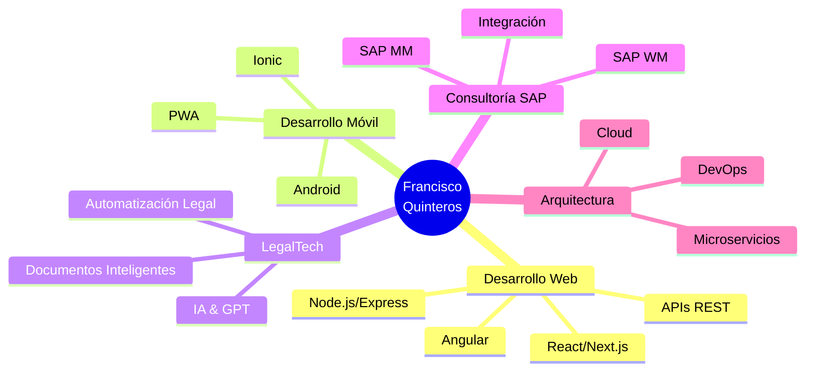

<div align="center">
  
<!-- Banner animado -->


<!-- Typing animation -->
<p align="center">
  
</p>

<!-- Badges de perfil -->
<p align="center">
  
  
  
  
</p>

</div>

---

## 🚀 Sobre mí

```typescript
const franciscoQuinteros = {
    ubicación: "🌎 Ecuador",
    trabajoActual: "Fullstack Developer & LegalTech Specialist",
    código: ["JavaScript", "TypeScript", "Python", "Java"],
    experiencia: {
        fullstack: ["React", "Angular", "Next.js", "Node.js", "Express"],
        mobile: ["Ionic", "Android Studio"],
        backend: ["FastAPI", "Flask", "Spring Boot"],
        databases: ["PostgreSQL", "MySQL", "Firebase"],
        cloud: ["Docker", "GitHub Actions"],
        legalTech: ["Automatización Legal", "GPT APIs", "Vosk AI"],
        sap: ["SAP MM", "SAP WM"]
    },
    arquitectura: ["REST APIs", "Microservicios", "SPA", "PWA"],
    desafíoActual: "Construir soluciones tecnológicas que simplifiquen procesos legales",
    pasiones: ["Innovación Legal", "Código Limpio", "Open Source", "Automatización"],
    quote: "El código es poesía, el software es arte ✨"
};
```

<div align="center">
  
### 💡 Lo que hago

🔹 **Desarrollo Fullstack** con tecnologías modernas y escalables  
🔹 **LegalTech Innovation** - Automatización de procesos legales  
🔹 **Consultoría SAP** en módulos MM (Gestión de Materiales) y WM (Warehouse Management)  
🔹 **Arquitectura de Software** - Diseño de sistemas robustos y mantenibles  
🔹 **Integración de IA** - Implementación de soluciones con GPT y reconocimiento de voz

</div>

---

## 🛠️ Stack Tecnológico

<div align="center">

### Frontend Development


### Backend Development


### Mobile Development


### Databases & Cloud


### DevOps & Tools


### LegalTech & Automation


### Design & Collaboration


### ERP & Business


</div>

---

## 📊 Estadísticas de GitHub

<div align="center">
  
  
  
  
</div>

<div align="center">
  
  
  
</div>

<div align="center">
  
  
  
</div>

---

## 🏆 Logros de GitHub

<div align="center">
  
  
  
</div>

---

## 💼 Experiencia Destacada

<table>
<tr>
<td width="50%">

### 👨‍💻 Desarrollo Fullstack
- ✅ Aplicaciones web escalables con React/Next.js
- ✅ APIs REST robustas con Node.js/Express
- ✅ Sistemas empresariales con Angular
- ✅ Arquitecturas de microservicios
- ✅ Integración de bases de datos relacionales

</td>
<td width="50%">

### ⚖️ LegalTech & Automatización
- ✅ Automatización de procesos legales
- ✅ Generación automática de documentos
- ✅ Chatbots con IA para consultas legales
- ✅ Reconocimiento de voz (Vosk AI)
- ✅ Integración GPT para análisis legal

</td>
</tr>
<tr>
<td width="50%">

### 📦 Consultoría SAP
- ✅ Implementación SAP MM (Gestión de Materiales)
- ✅ Configuración SAP WM (Warehouse Management)
- ✅ Optimización de procesos logísticos
- ✅ Capacitación y soporte técnico
- ✅ Integración con sistemas externos

</td>
<td width="50%">

### 📱 Desarrollo Móvil
- ✅ Apps híbridas con Ionic Framework
- ✅ Desarrollo nativo Android
- ✅ PWAs (Progressive Web Apps)
- ✅ Sincronización offline-first
- ✅ Integración con APIs REST

</td>
</tr>
</table>

---

## 🎯 Proyectos Destacados

<div align="center">

[](https://portfolio-five-gilt-51.vercel.app/)

</div>

<table width="100%">
<tr>
<td width="50%" valign="top">

### 🤖 LegalTech Automation Platform
Plataforma de automatización para despachos legales con:
- 📄 Generación automática de contratos
- 🎙️ Transcripción de audiencias con IA
- 📊 Dashboard de gestión de casos
- 🔐 Firma electrónica integrada

**Tech:** React, FastAPI, PostgreSQL, OpenAI API, Vosk

</td>
<td width="50%" valign="top">

### 📦 SAP Integration Suite
Suite de herramientas para integración SAP:
- 🔄 Sincronización de datos en tiempo real
- 📈 Reportes personalizados
- 🏭 Gestión de inventario avanzada
- 📊 Analytics y visualización

**Tech:** Java, Spring Boot, PostgreSQL, SAP APIs

</td>
</tr>
<tr>
<td width="50%" valign="top">

### 🏥 Healthcare Management System
Sistema de gestión para centros médicos:
- 👥 Gestión de pacientes y citas
- 📋 Historias clínicas electrónicas
- 💊 Control de farmacia
- 📊 Reportes estadísticos

**Tech:** Angular, Node.js, MySQL, Docker

</td>
<td width="50%" valign="top">

### 📱 Business Mobile App
Aplicación móvil empresarial con:
- 📊 Dashboard en tiempo real
- 🔔 Notificaciones push
- 📍 Geolocalización
- 💳 Integración de pagos

**Tech:** Ionic, Angular, Firebase, Stripe

</td>
</tr>
</table>

---

## 🎓 Formación & Certificaciones

<div align="center">

| 🎓 Título | 🏛️ Institución | 📅 Año |
|:---:|:---:|:---:|
| Ingeniería en Software | Universidad Tecnológica | 2020 |
| Abogado | Universidad Nacional | 2018 |
| SAP MM/WM Consultant | SAP Training Center | 2021 |
| Cloud Architecture | Google Cloud | 2022 |

</div>

---

## 🤝 Servicios Profesionales

<div align="center">



</div>

### 💼 Estoy disponible para:

<table>
<tr>
<td>

- 🚀 **Desarrollo de MVPs** - Lleva tu idea al mercado rápidamente
- 🏢 **Proyectos Empresariales** - Soluciones a medida para tu negocio
- ⚖️ **Automatización Legal** - Optimiza tus procesos legales
- 📦 **Consultoría SAP** - Mejora tu gestión logística
- 🎓 **Mentoría Tech** - Comparto mi experiencia

</td>
<td>

- 🔧 **Mantenimiento de Apps** - Soporte y mejoras continuas
- 🌐 **Integración de APIs** - Conecta tus sistemas
- 📱 **Apps Móviles** - Desde la idea hasta la tienda
- 🤖 **Soluciones con IA** - Integración de modelos GPT
- 💡 **Consultoría Técnica** - Orientación en decisiones tech

</td>
</tr>
</table>

---

## 📫 Conectemos

<div align="center">

[](https://portfolio-five-gilt-51.vercel.app/)
[](mailto:javierquiandra@gmail.com)
[](https://www.instagram.com/quinan_dev?igsh=MTB5ZG8zdHFlZm52cw==)
[](https://linkedin.com/in/francisco-quinteros)
[](https://github.com/JavierQuinan)

</div>

<div align="center">

### 💬 ¿Hablamos de tu próximo proyecto?

**📧 Email:** javierquiandra@gmail.com  
**📱 Instagram:** [@quinan_dev](https://www.instagram.com/quinan_dev?igsh=MTB5ZG8zdHFlZm52cw==)  
**🌐 Portfolio:** [Ver mis trabajos](https://portfolio-five-gilt-51.vercel.app/)

</div>

---

## 📈 Actividad de Desarrollo

<div align="center">

<!--START_SECTION:waka-->
<!--END_SECTION:waka-->

</div>

---

## 💭 Frase del Día

<div align="center">


</div>

---

## 🐍 Contribuciones

<div align="center">
  


</div>

---

<div align="center">
  
### ⭐ De mis repositorios favoritos

[](https://github.com/JavierQuinan)
[](https://github.com/JavierQuinan)

</div>

---

<div align="center">

### 🌟 "La tecnología bien aplicada puede transformar vidas y simplificar complejidades" 🌟


**⭐️ Si te gusta mi trabajo, considera darle una estrella a mis repositorios ⭐️**


</div>
