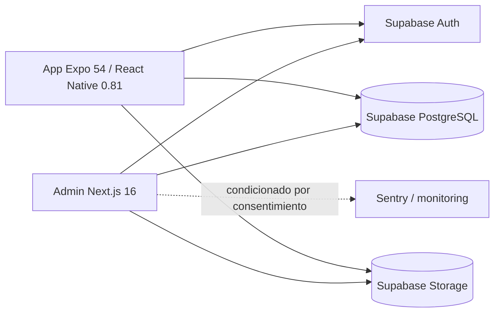

# FITBA / GYMORA — Caso de Estudio Sanitizado de Ingeniería Web + Mobile

[English version](./README.md)

> **Repositorio fuente:** privado  
> **Tipo de artefacto público:** arquitectura de producto / evidencia de ingeniería sanitizada  
> **Dominio:** operaciones fitness, entrenamiento, nutrición y engagement  
> **Base de evidencia:** metadatos actuales de paquetes y registros privados de sincronización/compliance  
> **Dirección futura:** [Roadmap de visión de producto](./ROADMAP.md) — separado explícitamente de la implementación actual

Este caso publica evidencia técnica del ecosistema privado FITBA/GYMORA sin exponer datos de clientes, registros de salud/fitness, configuración privada ni código comercial.

## Superficies del producto

El repositorio contiene dos superficies principales que comparten Supabase/PostgreSQL:



### Admin

Metadatos verificados muestran:

- Next.js 16;
- React 19;
- TypeScript;
- Supabase SSR/client;
- TanStack Query;
- Zod;
- Jest + Testing Library;
- Sentry;
- Tailwind CSS;
- librerías de reporting/export.

### App cliente

Metadatos verificados muestran:

- Expo 54;
- React Native 0.81.5;
- React 19;
- Expo Router 6;
- NativeWind;
- Supabase client;
- AsyncStorage;
- NetInfo;
- Expo Location;
- Expo Notifications;
- Expo Image Picker;
- charts;
- Jest / jest-expo / React Native Testing Library.

`Next.js` · `React` · `Expo` · `React Native` · `Supabase` · `PostgreSQL` · `TypeScript` · `Zod` · `Jest`

## Modelo de dominio compartido

Una auditoría privada de sincronización registra funcionalidad compartida entre panel y app en áreas como:

- autenticación y cuentas;
- clientes y membresías;
- rutinas y sesiones activas;
- nutrición y macros;
- progreso físico;
- gamificación y retos;
- actividades GPS/cardio;
- noticias/contenido;
- notificaciones;
- feedback;
- chat;
- privacidad/legal;
- organización/configuración;
- clases/reservas;
- biblioteca de ejercicios;
- suscripciones/pagos;
- wearables.

La evidencia importante no es el número de features: ambas superficies operan sobre un backend/modelo de datos compartido y requieren sincronización de reglas de negocio.

## Evidencia de ingeniería móvil

La app usa capacidades nativas reales:

```text
Expo Location        → GPS/cardio
Expo Notifications   → notificaciones push
Image Picker         → perfil/progreso/media
AsyncStorage         → estado local
NetInfo              → awareness de conectividad
Expo Router          → navegación móvil
React Native         → superficie Android/iOS
```

## Multi-tenant / límites de datos

El producto está orientado a organizaciones y usa Row-Level Security. Una auditoría privada registró 47 tablas compartidas y más de 62 políticas RLS en el snapshot revisado.

Esos números corresponden a evidencia de auditoría de ese momento y no garantizan automáticamente que toda futura migración preserve aislamiento. El control requiere revisión continua de migraciones y validación cross-organization.

## Arquitectura de privacidad y compliance

El proyecto incluye implementación dedicada para consentimiento/estado legal alineada en su documentación con la LOPDP de Ecuador.

La evidencia privada incluye:

- documentos legales versionados;
- hashes SHA-256 por versión;
- evidencia inmutable de aceptación;
- definiciones de consentimientos opcionales;
- auditoría de cookie consent;
- compliance audit logs;
- estructuras para solicitudes de derechos;
- RLS sobre tablas legales;
- separación contextual `admin_panel` / `client_app`;
- constraints entre consentimiento otorgado y timestamp;
- comportamiento de Sentry/analytics condicionado por consentimiento en el diseño documentado.

Esto demuestra compliance como estado de aplicación, constraints y auditabilidad, no solo como páginas estáticas.

## Separación de entornos

Admin y mobile poseen mecanismos separados para desarrollo/test/producción. El showcase no expone URLs de Supabase, service-role keys, DSN de Sentry ni identificadores productivos.

## Estado de calidad — explícito

La auditoría privada registra builds exitosos para admin y mobile en el momento de revisión, pero también documenta cobertura automatizada todavía baja: aproximadamente 29 tests de admin y pocos archivos de tests mobile en ese snapshot.

Se mantienen como pendientes productivos:

- ampliar validación Zod;
- límites de paginación;
- rate limiting de escritura;
- más tests de auth/pagos/rutinas;
- Supabase productivo dedicado y migraciones;
- builds EAS productivos;
- validación en dispositivos reales;
- publicación en stores;
- verificación end-to-end panel ↔ app.

Por eso este caso no afirma certificación productiva completa ni cobertura exhaustiva.

## Decisiones de ingeniería demostradas

FITBA/GYMORA sirve como evidencia de:

- web + native mobile dentro de un mismo dominio;
- Supabase/PostgreSQL compartido;
- arquitectura consciente de RLS;
- comportamiento por organización/módulo;
- GPS y notificaciones nativas;
- modelado de entrenamiento/nutrición/contenido;
- consentimiento legal y auditabilidad como capacidades de producto;
- auditorías explícitas de sincronización admin/app.

## Qué no se publica

- perfiles reales de clientes;
- medidas corporales o fotos de progreso;
- datos de salud/wearables;
- trazas GPS;
- chats;
- identificadores productivos de Supabase;
- configuraciones específicas de organización;
- source privado;
- material de firma de stores.

## Estado en portfolio

Este es un caso de estudio sanitizado publicado mientras el producto subyacente sigue privado. Un futuro demo público móvil deberá usar tenant demo y datos fitness sintéticos.

## Dirección futura

El [Roadmap de visión de producto](./ROADMAP.md) separa `NEXT / LATER / EXPLORE` de la evidencia actual y cubre expansión organización/coach, retención/lifecycle y capacidades inteligentes fitness acotadas.

---

Portfolio público: [Francisco Quinteros / JavierQuinan](https://github.com/JavierQuinan)  
Política de publicación: [Portfolio Governance](../../docs/PORTFOLIO_GOVERNANCE.md)
