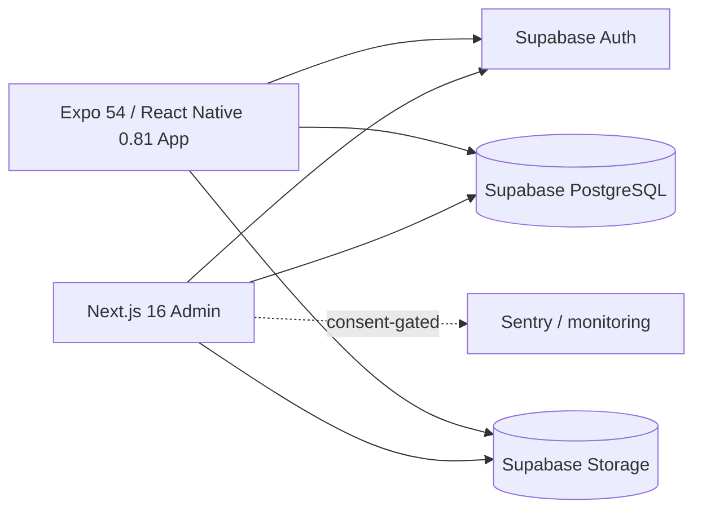

# FITBA / GYMORA — Sanitized Web + Mobile Engineering Case Study

> **Source repository:** private  
> **Public artifact type:** sanitized product architecture / engineering evidence  
> **Domain:** fitness operations, training, nutrition and client engagement  
> **Evidence basis:** current package metadata plus private synchronization/compliance audit records

This case study exposes technical evidence from the private FITBA/GYMORA ecosystem without publishing customer data, health/fitness records, private environment configuration or commercial source code.

## Product surfaces

The current repository contains two primary application surfaces sharing Supabase/PostgreSQL data:



### Admin

Verified package metadata shows:

- Next.js 16
- React 19
- TypeScript
- Supabase SSR/client libraries
- TanStack Query
- Zod
- Jest + Testing Library
- Sentry integration
- Tailwind CSS
- reporting/export libraries

### Client app

Verified package metadata shows:

- Expo 54
- React Native 0.81.5
- React 19
- Expo Router 6
- NativeWind
- Supabase client
- AsyncStorage
- NetInfo
- Expo Location
- Expo Notifications
- Expo Image Picker
- React Native charts
- Jest / jest-expo / React Native Testing Library

`Next.js` · `React` · `Expo` · `React Native` · `Supabase` · `PostgreSQL` · `TypeScript` · `Zod` · `Jest`

## Cross-surface domain model

A private synchronization audit records shared functionality between the admin panel and mobile app across areas such as:

- authentication and account flows
- clients and memberships
- training routines and active sessions
- nutrition and macro tracking
- physical progress
- gamification/challenges
- GPS/cardio activities
- news/content
- notifications
- feedback
- chat
- legal/privacy flows
- organization/settings
- classes/reservations
- library/exercise content
- subscriptions/payments
- wearables

The important engineering point is not the feature count itself: both surfaces operate against a shared backend/data model and require synchronization of business rules rather than independent mock applications.

## Mobile engineering evidence

The mobile package contains concrete native-capability dependencies instead of only a responsive web wrapper:

```text
Expo Location        → GPS/cardio capability
Expo Notifications   → push-notification client capability
Image Picker         → profile/progress/media workflows
AsyncStorage         → local client state
NetInfo              → network-awareness support
Expo Router          → native navigation/routing
React Native         → Android/iOS application surface
```

The private audit documents GPS activity tracking, progress visualization, training execution, nutrition, gamification and other client flows connected to shared data.

## Multi-tenant / data boundary model

The product is organization-oriented and its Supabase layer uses row-level security policies. A private synchronization audit records 47 shared tables and 62+ RLS policies at the time of that review.

Those numbers are audit-record evidence, not a guarantee that every future migration automatically preserves isolation. Production promotion therefore requires migration review and cross-organization validation as an ongoing control.

## Privacy and legal-compliance architecture

This project contains a dedicated implementation for consent/legal state aligned in its documentation with Ecuador's LOPDP.

The private evidence includes:

- versioned legal documents
- SHA-256 content hashes for document versions
- immutable legal-acceptance evidence
- optional consent definitions
- cookie-consent audit records
- compliance audit logs
- data-rights request structures
- RLS on legal tables
- contextual separation between `admin_panel` and `client_app`
- constraints connecting granted consent with grant timestamps
- Sentry/analytics behavior conditioned on consent in the documented design

This is relevant portfolio evidence because compliance is represented as application state, schema constraints and auditability — not only as static Terms/Privacy pages.

## Environment separation

The admin package includes separate development/test/production commands and environment handling. The mobile package also includes environment-switching scripts for development, testing and production profiles.

Public case studies do not expose the underlying Supabase URLs, service-role values, Sentry DSNs or customer environment identifiers.

## Quality status — intentionally explicit

The private synchronization audit records successful builds for admin and mobile at the time of review, but it also documents **low automated-test coverage**: approximately 29 admin tests and only a small number of mobile test files in that snapshot.

The same record retains production checklist items including:

- stronger Zod input validation on several API routes
- pagination limits
- write-side rate limiting
- increased tests around auth/payments/routines
- dedicated production Supabase provisioning/migrations
- EAS production builds
- real-device functional testing
- store submission
- end-to-end panel ↔ app verification

This case study therefore does not claim that the product is fully production-certified or comprehensively tested.

## Engineering decisions demonstrated

FITBA/GYMORA is useful public evidence for:

- maintaining web and native-mobile surfaces in one product domain
- shared Supabase/PostgreSQL data design
- RLS-aware application architecture
- organization/module-driven behavior
- native GPS and notification capabilities
- training/nutrition/content domain modeling
- legal consent and auditability as first-class product concerns
- explicit synchronization audits between administrative and client surfaces

## What is deliberately not public

- customer/member profiles
- body measurements or progress photos
- health/wearable records
- GPS traces
- chat content
- production Supabase identifiers or service keys
- organization-specific configuration
- private source code
- app-store signing material

## Portfolio status

This is a **published sanitized case study**, while the underlying product remains private. A future public mobile demo should use a dedicated demo tenant and synthetic fitness data before screenshots/video are added.

---

Public portfolio: [Francisco Quinteros / JavierQuinan](https://github.com/JavierQuinan)  
Repository publication policy: [Portfolio Governance](../../docs/PORTFOLIO_GOVERNANCE.md)
