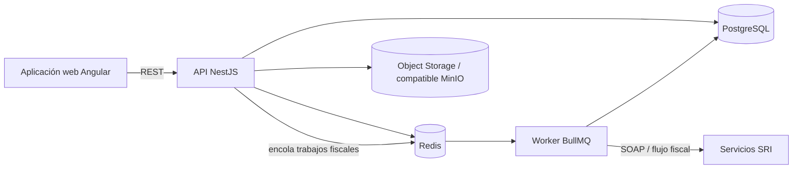

# KOVI OS — Caso de Estudio de Ingeniería SaaS Sanitizado

[English version](./README.md)

> **Repositorio fuente:** privado  
> **Tipo de artefacto público:** arquitectura sanitizada / evidencia de ingeniería  
> **Dominio:** facturación electrónica de Ecuador y SaaS empresarial  
> **Evidencia revisada:** documentación y metadatos de código del repositorio privado hasta julio de 2026  
> **Dirección futura:** [Roadmap de visión de producto](./ROADMAP.md) — explícitamente separado de la evidencia de implementación actual

Este caso de estudio publica evidencia técnica suficiente para evaluar la ingeniería detrás de KOVI sin exponer código comercial, datos de tenants, certificados, credenciales ni documentos fiscales reales.

## Espacio del problema

KOVI es una plataforma SaaS multi-tenant diseñada alrededor de operaciones empresariales ecuatorianas y facturación electrónica. El reto de ingeniería combina tenancy, autenticación, procesamiento asíncrono y monitoreo operacional con requisitos fiscales como generación XML, validación XSD, certificados digitales y comunicación con el SRI.

El producto privado no se presenta aquí como una suite contable genérica ni como software plenamente certificado para producción. La evidencia revisada corresponde a una ruta de madurez de preproducción/piloto controlado, con producción SRI real condicionada a evidencia de piloto.

## Arquitectura verificada



El repositorio está organizado como monorepo Nx/pnpm con tres superficies principales:

- `apps/web` — frontend Angular
- `apps/api` — API NestJS
- `apps/worker` — workers fiscales/background

Los paquetes compartidos cubren tipos, utilidades, funciones de SDK de facturación y conceptos de catálogos. La infraestructura incluye Docker y configuración de reverse proxy.

## Capacidades de ingeniería verificadas

### SaaS multi-tenant

El aislamiento entre tenants es una preocupación arquitectónica explícita. La preparación fiscal y las operaciones de certificados están acotadas por tenant, y la evidencia privada incluye escenarios de pruebas orientados al aislamiento.

### Pipeline de documentos fiscales

La implementación privada contiene un pipeline de facturación electrónica orientado al SRI que incluye:

1. validación de dominio/documento;
2. generación XML;
3. validación XSD estricta antes de transmitir;
4. flujo de firma con certificado;
5. procesamiento asíncrono mediante workers/colas;
6. integración SOAP con el SRI;
7. estados y monitoreo fiscal.

El XML inválido está diseñado para fallar localmente antes del envío externo.

### Seguridad de certificados

La evidencia revisada documenta manejo seguro de certificados `.p12`, incluyendo:

- cifrado AES-256-GCM en reposo;
- validación antes de persistir;
- rechazo de certificados inválidos, vencidos, demasiado grandes o con contraseña incorrecta antes de reemplazar un certificado válido anterior;
- respuestas API que no exponen base64, material privado ni contraseña;
- manejo en memoria de la contraseña en frontend con limpieza explícita;
- estados UI para no cargado, válido, próximo a vencer, vencido y error.

Este caso público no contiene certificados, llaves privadas ni credenciales.

### Procesamiento asíncrono

Redis/BullMQ separa el procesamiento fiscal/background del request síncrono de web/API. Esto permite trabajo reintentable y mantiene las operaciones fiscales externas fuera del ciclo inmediato de la interfaz.

### Observabilidad operacional

La evidencia privada incluye monitoreo fiscal, conceptos de readiness, runbooks y checklists de preproducción. El objetivo es exponer si un tenant está en capacidad operativa de emitir y qué acción debe tomarse cuando no lo está.

## Evidencia de calidad

El baseline backend más reciente verificado documenta:

- TypeScript con cero errores en web, API y worker;
- builds exitosos para las tres superficies;
- 35 suites Jest: 33 pasaron y 2 quedaron bloqueadas por un problema preexistente de resolución del módulo `express` bajo pnpm, no por lógica de negocio;
- 348 tests: 346 pasaron y 2 quedaron skipped de forma documentada;
- cobertura focalizada para fallos de certificados/readiness fiscal;
- secret scanning sobre el diff revisado.

La validación visual end-to-end en navegador permanece fuera de ese baseline backend y no se presenta como completada sin evidencia.

## Modelo de seguridad destacado

```text
Límite de tenant
    ↓
Request API autenticado
    ↓
Persistencia/query acotada al tenant
    ↓
Configuración fiscal cifrada
    ↓
Artefacto fiscal validado + firmado
    ↓
Worker asíncrono / integración externa controlada
    ↓
Estado operacional auditable
```

KOVI demuestra temas como:

- mínima exposición de credenciales fiscales;
- cifrado de información sensible en reposo;
- aislamiento multi-tenant;
- separación de background jobs;
- validación previa a integración externa;
- reemplazo seguro de certificados;
- readiness operacional explícito;
- runbooks y evidencia de seguridad como parte del delivery.

## Perfil tecnológico

`Angular` · `TypeScript` · `NestJS` · `Nx` · `pnpm` · `PostgreSQL` · `Redis` · `BullMQ` · `Docker` · `SOAP` · `XML/XSD` · `AES-256-GCM` · `Playwright tooling` · `Jest`

## Qué no se publica deliberadamente

- código privado de la aplicación;
- direcciones de infraestructura productiva;
- datos de clientes/tenants;
- certificados o contraseñas SRI;
- material de firma;
- variables productivas;
- dumps de base de datos;
- XML fiscales reales;
- configuración comercial interna.

## Estado de ingeniería

La evidencia corresponde a una ruta de madurez de piloto controlado/preproducción. No implica que todo módulo planificado de contabilidad, POS, inventario, impuestos o multi-país esté terminado.

## Por qué este proyecto importa en mi portfolio

KOVI demuestra la intersección entre **arquitectura SaaS empresarial, backend asíncrono, manejo seguro de credenciales e integración con procesos regulados**.

## Dirección futura

El [Roadmap de visión de producto](./ROADMAP.md) separa resultados `NEXT / LATER / EXPLORE` de la evidencia actual. Los elementos de roadmap no se consideran implementados ni incluyen fechas comprometidas.

---

Índice público del portfolio: [Francisco Quinteros / JavierQuinan](https://github.com/JavierQuinan)  
Política de publicación: [Portfolio Governance](../../docs/PORTFOLIO_GOVERNANCE.md)
