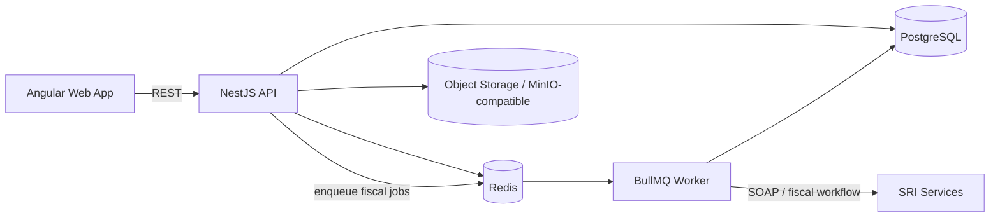

# KOVI OS — Sanitized SaaS Engineering Case Study

> **Source repository:** private  
> **Public artifact type:** sanitized architecture / engineering evidence  
> **Domain:** Ecuador electronic invoicing and enterprise SaaS  
> **Evidence reviewed:** private repository documentation and code metadata through July 2026  
> **Future direction:** [Product Vision Roadmap](./ROADMAP.md) — explicitly not current implementation evidence

This case study exposes enough technical evidence to evaluate the engineering work behind KOVI without publishing commercial source code, tenant data, certificates, credentials or fiscal documents.

## Problem space

KOVI is a multi-tenant SaaS platform designed around Ecuadorian business and electronic-invoicing workflows. The engineering challenge combines ordinary SaaS concerns — tenancy, authentication, background processing and operational monitoring — with fiscal integration requirements such as XML generation, schema validation, digital certificates and SRI communication.

The private product is intentionally not represented here as a generic accounting suite or as fully production-certified software. The reviewed evidence shows a controlled-pilot/preproduction maturity path, with real-production SRI rollout gated by pilot evidence.

## Verified architecture



The repository is organized as an Nx/pnpm monorepo with three application surfaces:

- `apps/web` — Angular frontend
- `apps/api` — NestJS API
- `apps/worker` — background fiscal workers

Shared packages cover types, utilities, invoice-oriented SDK functionality and catalog concepts. Infrastructure includes Docker and reverse-proxy configuration.

## Verified engineering capabilities

### Multi-tenant SaaS

Tenant isolation is an explicit architectural concern. Fiscal readiness and certificate operations are scoped by tenant, and the reviewed backend tests include tenant-isolation scenarios.

### Fiscal document pipeline

The private implementation contains a pipeline for Ecuador SRI-oriented electronic invoicing that includes:

1. document/domain validation
2. XML generation
3. strict XSD validation before transmission
4. certificate-backed signing workflow
5. asynchronous processing through workers/queues
6. SOAP-facing SRI integration
7. fiscal status/monitoring workflows

Invalid XML is designed to fail locally before the outbound SRI step.

### Certificate security

The product includes secure `.p12` certificate handling. Reviewed implementation evidence documents:

- AES-256-GCM encryption at rest
- certificate validation before persistence
- rejection of invalid, expired, oversized or incorrectly password-protected certificate files before replacing the previous valid certificate
- API responses that do not return certificate base64/private material or the certificate password
- in-memory frontend handling of the certificate password with explicit clearing after cancel/success paths
- explicit UI states for not loaded, valid, expiring, expired and load error

No certificate, private key or credential is included in this public case study.

### Asynchronous processing

Redis/BullMQ workers separate fiscal/background processing from the synchronous web/API request path. This architecture supports retryable work and keeps external fiscal operations outside the user-facing request lifecycle.

### Operational observability

Private product evidence includes fiscal-monitoring and readiness concepts, operational runbooks and preproduction checklists. The objective is not only to create documents but to expose whether a tenant is operationally able to issue them and what action is required when it is not.

## Quality evidence

A later private validation record documents:

- TypeScript checks with zero errors across web, API and worker
- successful builds for the three application surfaces
- 33 Jest suites
- 341 passed tests
- 2 skipped tests documented as pre-existing/justified
- 0 failed tests in that recorded run
- focused backend coverage for certificate/fiscal-readiness failure paths
- secret scanning of the reviewed diff

The same evidence explicitly states that a browser-based visual validation flow was still pending in that session. This case study preserves that distinction rather than converting code/test evidence into an unsupported end-to-end claim.

## Security model highlighted by this project

```text
Tenant boundary
    ↓
Authenticated API request
    ↓
Tenant-scoped persistence/query
    ↓
Encrypted fiscal configuration
    ↓
Validated + signed fiscal artifact
    ↓
Async worker / controlled external integration
    ↓
Auditable operational state
```

Relevant engineering themes demonstrated by KOVI include:

- least-exposure handling of fiscal credentials
- encrypted secrets/data at rest
- multi-tenant data isolation
- background-job separation
- validation before external integration
- failure-safe certificate replacement
- explicit operational readiness states
- security evidence and runbooks as part of delivery

## Technology profile

`Angular` · `TypeScript` · `NestJS` · `Nx` · `pnpm` · `PostgreSQL` · `Redis` · `BullMQ` · `Docker` · `SOAP` · `XML/XSD` · `AES-256-GCM` · `Playwright tooling` · `Jest`

## What is deliberately not public

This showcase does **not** expose:

- private application source code
- production infrastructure addresses
- tenant/customer data
- SRI certificates or passwords
- signing material
- production environment variables
- database dumps
- real fiscal XMLs
- internal commercial configuration

## Engineering status

The evidence reviewed for this public artifact corresponds to a controlled-pilot/preproduction maturity path. It should not be interpreted as a claim that every planned accounting, POS, inventory, tax or multi-country module is complete.

The private roadmap explicitly excluded several features from the early scope in order to protect fiscal-core quality and pilot readiness.

## Why this project matters in my portfolio

KOVI demonstrates the intersection of **enterprise SaaS architecture, asynchronous backend engineering, security-sensitive credential handling and regulated business integration**. It is stronger evidence of my current engineering direction than publishing commercial source code would be.

## Future product direction

The public [Product Vision Roadmap](./ROADMAP.md) describes `NEXT / LATER / EXPLORE` outcomes separately from current evidence. Roadmap items are not implementation claims and intentionally omit delivery dates.

---

Public portfolio index: [Francisco Quinteros / JavierQuinan](https://github.com/JavierQuinan)  
Repository publication policy: [Portfolio Governance](../../docs/PORTFOLIO_GOVERNANCE.md)
