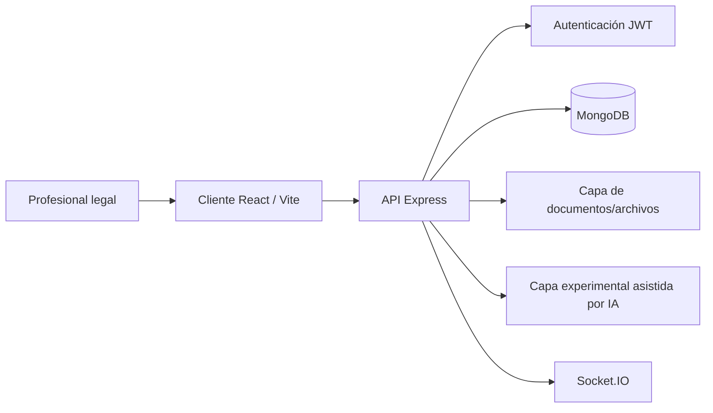

# LegalTech Automation Platform — Caso de Estudio de Ingeniería Sanitizado

[English version](./README.md)

> **Repositorio fuente:** privado  
> **Tipo de artefacto público:** arquitectura sanitizada / evidencia de product engineering  
> **Dominio:** operaciones legales y software de workflows  
> **Madurez representada:** prototipo/producto activo, no IA legal certificada para producción  
> **Dirección futura:** [Roadmap de visión de producto](./ROADMAP.md) — separado explícitamente de la evidencia actual

Este caso documenta trabajo verificable de ingeniería de una plataforma LegalTech privada sin publicar datos de casos, información de clientes, credenciales ni código propietario.

## Perfil tecnológico verificado

Los metadatos actuales del repositorio confirman:

- React 18 + Vite;
- backend Express;
- MongoDB / Mongoose;
- JWT + bcryptjs;
- Socket.IO;
- Multer/file uploads;
- tooling de generación/parsing PDF;
- Tesseract.js OCR a nivel de aplicación;
- dependencia del SDK de OpenAI;
- Zod / React Hook Form;
- TanStack Query;
- Zustand;
- Helmet y rate limiting;
- node-forge y tooling orientado a certificados.

`React` · `Vite` · `Express` · `MongoDB` · `Mongoose` · `JWT` · `Socket.IO` · `PDF/OCR tooling` · `OpenAI SDK`

## Arquitectura

## Superficie backend verificada

El backend privado contiene módulos de rutas para áreas como:

- autenticación;
- casos;
- clientes;
- contratos;
- calendario;
- consultas;
- analytics;
- auditoría;
- backups;
- certificados;
- rutas asistidas por IA;
- operaciones administrativas/de base de datos.

La existencia de módulos no se presenta como evidencia de que todos tengan la misma madurez productiva.

## Modelo de workflow legal

La dirección del producto se centra en soporte de operaciones legales, no en un chatbot aislado. La arquitectura combina asuntos/casos, clientes, documentos, contratos, calendario/consultas, auditabilidad y capacidades de comunicación.

El principio de producto es **workflow first, IA como capa de asistencia**, no IA como reemplazo de la decisión jurídica.

## Estado de IA — límite explícito

El repositorio contiene dependencia del SDK de OpenAI y rutas orientadas a IA, pero varias capacidades avanzadas permanecen simuladas/prototipadas.

Existen endpoints de análisis documental, predicción de resultados y asistencia de redacción con estructuras mock/template e integration placeholders.

Por eso este caso público **no afirma**:

- razonamiento jurídico validado;
- búsqueda jurisprudencial productiva;
- precisión predictiva sobre resultados judiciales;
- asesoría jurídica autónoma;
- pipeline RAG productivo;
- inferencia verificada OpenAI/Claude en todas las rutas.

La descripción correcta es: **prototipo LegalTech asistido por IA con puntos de integración de proveedores y diseño orientado a workflows**.

## Dirección de procesamiento documental

El repositorio incluye dependencias/módulos para:

- parsing PDF;
- generación PDF;
- generación DOCX;
- OCR;
- uploads multipart;
- tooling orientado a certificados/firma digital.

Esto lo hace relevante para ingeniería LegalTech document-centric incluso donde los flujos avanzados todavía requieren hardening.

## Primitivas de autenticación y hardening

El backend incluye JWT, bcryptjs, Helmet, express-rate-limit, CORS, Mongoose y manejo de requests/archivos. Son componentes de seguridad, no una afirmación de auditoría completa.

## Límite actual de calidad

El backend aún no tiene una suite automatizada ejecutable configurada como baseline (`npm test` no ejecuta tests). El root declara Jest, pero no existe un baseline único verificado para el caso de estudio.

Por lo tanto, automated testing se mantiene como prioridad de hardening. Antes de promover el proyecto a un nivel público de evidencia más fuerte debe incluir al menos:

1. unit/integration tests de auth y autorización;
2. tests de acceso a casos/clientes/documentos;
3. tests de validación de uploads;
4. contract tests y mocked-provider tests de IA;
5. tests de redacción de audit logs;
6. critical-flow tests frontend;
7. fixtures demo deterministas;
8. CI para build/lint/test.

## Higiene del repositorio

Durante la revisión privada se eliminaron archivos de entorno del árbol activo y los ejemplos se sustituyeron por placeholders. Cualquier credencial históricamente versionada debe considerarse comprometida y rotarse independientemente de la limpieza Git.

## Privacidad y uso profesional

La evidencia pública nunca debe contener:

- nombres/identificadores de clientes reales;
- hechos confidenciales de casos;
- comunicaciones privilegiadas;
- documentos legales subidos;
- tokens;
- API/provider keys;
- certificados/llaves privadas;
- exports productivos;
- credenciales judiciales reales.

Cualquier demo visual futura requiere datos sintéticos.

## Qué demuestra actualmente

La evidencia más fuerte es:

- modelado de workflows legales;
- arquitectura full-stack React + Express + MongoDB;
- múltiples dominios legales/operacionales;
- decisiones de tecnología document-centric;
- primitivas de autenticación/seguridad;
- arquitectura realtime-capable;
- límites explícitos de integración IA;
- diferenciación correcta entre prototipo IA e inferencia productiva verificada.

## Próximo gate de ingeniería

El siguiente paso no es ampliar marketing features. Es volver la plataforma auditable y reproducible: cerrar deuda de higiene, establecer tests automatizados, reforzar autorización, definir provider abstraction para IA, incorporar threat models de documentos/privacidad y crear un tenant demo totalmente sintético.

## Dirección futura

El [Roadmap de visión de producto](./ROADMAP.md) separa `NEXT / LATER / EXPLORE` de la evidencia actual y no convierte capacidades futuras de IA, portal cliente o automatización en claims actuales.

---

Portfolio público: [Francisco Quinteros / JavierQuinan](https://github.com/JavierQuinan)  
Política de publicación: [Portfolio Governance](../../docs/PORTFOLIO_GOVERNANCE.md)
