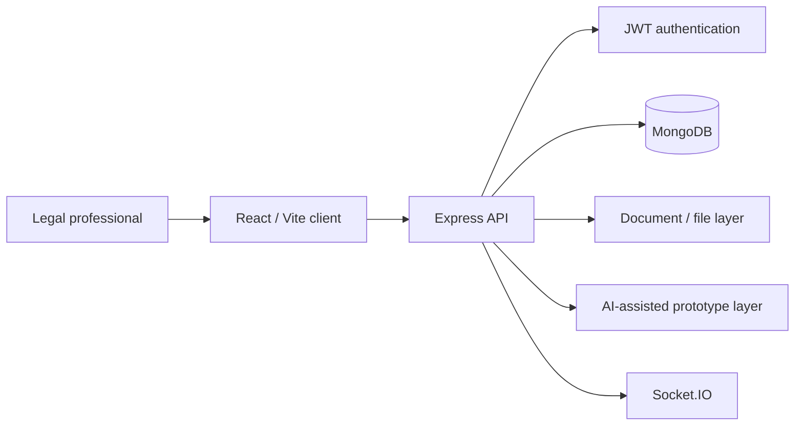

# LegalTech Automation Platform — Sanitized Engineering Case Study

> **Source repository:** private  
> **Public artifact type:** sanitized architecture / product-engineering evidence  
> **Domain:** legal operations and workflow software  
> **Maturity represented here:** active prototype/product development, not production-certified legal AI

This case study documents verifiable engineering work from a private LegalTech platform while deliberately excluding case data, client information, credentials and proprietary source code.

## Verified technology profile

Current repository metadata confirms:

- React 18 + Vite frontend
- Express backend
- MongoDB / Mongoose
- JWT + bcryptjs authentication primitives
- Socket.IO
- Multer/file-upload support
- PDF generation/parsing tooling
- Tesseract.js OCR dependency at the application level
- OpenAI SDK dependency
- Zod / React Hook Form
- TanStack Query
- Zustand
- Helmet and rate-limit dependencies in the backend
- node-forge / certificate-oriented backend tooling

`React` · `Vite` · `Express` · `MongoDB` · `Mongoose` · `JWT` · `Socket.IO` · `PDF/OCR tooling` · `OpenAI SDK`

## Architecture snapshot

## Verified backend surface

The private backend contains route modules for areas including:

- authentication
- cases
- clients
- contracts
- calendar
- consultations
- analytics
- audit
- backups
- certificates
- AI-assisted routes
- database/administrative operations

This is concrete domain breadth in the source tree; it should not be confused with a claim that every route/module has reached production maturity.

## Legal workflow model

The product direction represented in the codebase centers on software support for legal operations rather than a single chatbot. The architecture combines matter/case records, clients, documents, contracts, calendar/consultation workflows, auditability and communication-oriented capabilities.

That product framing is the primary value of the project: **workflow first, AI as an assistive layer**, not AI as a substitute for legal decision-making.

## AI status — explicit boundary

The repository contains an OpenAI SDK dependency and AI-oriented backend routes, but review of those routes shows that several advanced capabilities are currently **simulated/prototyped**.

Examples include document analysis, outcome prediction and legal-writing endpoints that currently return generated mock structures or template responses with comments indicating where an external model integration would later be connected.

Therefore this public case study does **not** claim:

- validated legal reasoning
- production-grade jurisprudence retrieval
- predictive accuracy for judicial outcomes
- autonomous legal advice
- a production RAG pipeline
- verified OpenAI/Claude inference on every AI route

The correct engineering description is: **AI-assisted LegalTech prototype with provider/tooling integration points and workflow-oriented route design**.

## Document-processing direction

The repository includes dependencies and modules useful for document-centric workflows, including:

- PDF parsing
- PDF generation
- DOCX generation
- OCR tooling
- multipart uploads
- certificate/digital-signature-oriented dependencies

These capabilities make the codebase relevant to document-heavy LegalTech engineering even where individual advanced workflows still require hardening or integration work.

## Authentication and API hardening primitives

The backend package includes:

- JWT
- bcryptjs
- Helmet
- express-rate-limit
- CORS
- Mongoose
- request/file handling

Those dependencies and middleware structures are evidence of security-oriented building blocks, not a blanket assertion that the application has passed a full security assessment.

## Current quality boundary

The backend package currently has no configured executable automated-test suite (`npm test` exits with “no test specified”). The root package declares Jest, but a single canonical test baseline has not been verified for this case study.

Accordingly, automated testing is a **hardening priority**, not a portfolio claim.

Before promotion to a stronger public engineering tier, the private product should establish at minimum:

1. backend unit/integration tests for auth and authorization
2. case/client/document access-control tests
3. file-upload validation tests
4. AI provider contract tests and mocked-provider tests
5. audit/log redaction tests
6. frontend critical-flow tests
7. deterministic seed/demo data
8. CI enforcement of build/lint/test

## Repository hygiene remediation

During the private-repository review, committed environment files were removed from the active tree and environment examples were converted to placeholders. The public case study contains no provider API keys or private credentials.

Any credential that was historically committed must be treated as compromised and rotated independently from Git cleanup.

## Privacy and professional-use boundary

A LegalTech product can contain particularly sensitive information. Public evidence must therefore never include:

- names or identifiers of real clients
- confidential case facts
- privileged communications
- uploaded legal documents
- authentication tokens
- API/provider keys
- certificates/private signing material
- production database exports
- real judicial credentials

Synthetic fixtures/screenshots are required for any future visual demo.

## What this project demonstrates today

The strongest verified portfolio evidence is:

- domain modeling for legal workflows
- React + Express + MongoDB full-stack architecture
- multiple legal/business route domains
- document-processing technology choices
- authentication/security primitives
- real-time capable architecture
- awareness of AI integration boundaries
- ability to distinguish prototype AI from verified production inference

## Next engineering gate

The next maturity step is not adding more marketing features. It is to make the platform auditable and reproducible: remove remaining repository hygiene debt, establish automated tests, tighten authorization boundaries, define a provider abstraction for AI, add document/privacy threat models and create a synthetic demo tenant.

---

Public portfolio: [Francisco Quinteros / JavierQuinan](https://github.com/JavierQuinan)  
Repository publication policy: [Portfolio Governance](../../docs/PORTFOLIO_GOVERNANCE.md)
