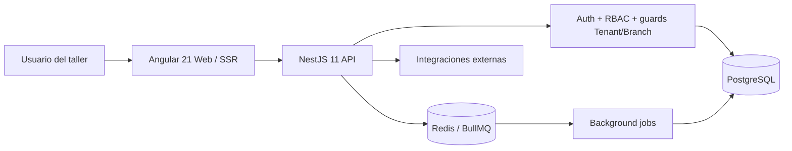

# MOTORIX / TecnoAuto — Caso de Estudio de Ingeniería SaaS Sanitizado

[English version](./README.md)

> **Repositorio fuente:** privado  
> **Tipo de artefacto público:** arquitectura sanitizada / evidencia de ingeniería  
> **Dominio:** SaaS de gestión para talleres automotrices  
> **Base de evidencia:** metadatos actuales del repositorio privado, documentación de arquitectura y registros de auditoría de seguridad/RBAC  
> **Dirección futura:** [Roadmap de visión de producto](./ROADMAP.md) — separado explícitamente de la implementación actual

Este caso documenta trabajo de ingeniería del producto privado MOTORIX/TecnoAuto sin publicar código comercial, credenciales de producción, registros de clientes ni secretos de despliegue.

## Espacio del problema

MOTORIX es un ERP/SaaS multi-tenant enfocado en talleres automotrices y negocios de servicios relacionados. Modela clientes, vehículos, órdenes de trabajo, inventario, facturación, sucursales, usuarios y acceso a módulos por tenant.

El problema de ingeniería va más allá de CRUD: cada request y capacidad de UI debe respetar límites de empresa/tenant, contexto de sucursal, roles/permisos y entitlements del producto.

## Perfil tecnológico verificado

El source privado actual incluye:

- Angular 21 con soporte SSR;
- TypeScript 5.x;
- NestJS 11;
- TypeORM 0.3;
- PostgreSQL;
- JWT + bcrypt;
- guards de roles/permisos;
- BullMQ + Redis;
- WebSockets / Socket.IO;
- Swagger/OpenAPI;
- Docker e infraestructura/runbooks;
- Jest/Supertest para backend;
- infraestructura de tests Angular/Jasmine.

`Angular` · `NestJS` · `TypeScript` · `PostgreSQL` · `TypeORM` · `BullMQ` · `Redis` · `JWT` · `RBAC` · `SSR` · `Docker`

## Arquitectura



## Límites multi-tenant y de sucursal

El aislamiento de tenant se trata como propiedad de seguridad explícita, no como convención de interfaz. La documentación revisada cubre:

- acceso backend acotado por empresa/tenant;
- restricciones cross-tenant para usuarios ordinarios;
- controles branch-aware;
- RBAC;
- permisos granulares;
- manejo separado para operaciones globales/super-admin;
- revisión de endpoints y rutas frontend.

Las auditorías detectaron y corrigieron defectos de aislamiento durante el desarrollo y conservaron gaps pendientes de validación. Por eso este caso no convierte una auditoría parcial en una afirmación genérica de seguridad absoluta.

## Modelo de autorización

```text
Usuario autenticado
    ↓
Rol global / regla privilegiada cross-tenant
    ↓
Límite tenant/empresa
    ↓
Límite de sucursal
    ↓
Permiso granular
    ↓
Operación de dominio
```

La visibilidad de UI es apoyo de UX; la autorización backend permanece como límite autoritativo.

## Temas de arquitectura de producto

### Modularidad automotriz

El producto contiene módulos y verticales orientados al sector automotriz: taller, lubricadora/servicio rápido, car wash/detailing y repuestos/inventario. No pretende presentarse como ERP genérico para industrias no relacionadas.

### Operación multi-sucursal

El contexto de sucursal se propaga por la aplicación para permitir scoping operativo y de permisos más allá del tenant.

### Entitlements SaaS

La arquitectura incluye conceptos de módulos/entitlements por organización en lugar de depender únicamente de menús hardcodeados.

### Background e integraciones

El backend incluye BullMQ/Redis y scripts orientados a workers para separar tareas asíncronas e integraciones externas de los flujos CRUD síncronos.

## Evidencia de seguridad

La documentación privada incluye material específico para:

- auditorías de aislamiento multi-tenant;
- matrices RBAC por endpoint;
- hardening;
- manejo de secretos/configuración;
- sanitización de audit logs;
- checklists de producción/preproducción;
- expectativas de rate limiting;
- migraciones y go-live.

Una auditoría registrada describe la postura de aislamiento backend como ampliamente correcta después de corregir dos problemas críticos, manteniendo explícitamente follow-ups pendientes. Esa precisión es preferible a afirmar simplemente que el sistema es “seguro”.

## Gobierno de base de datos

El producto usa migraciones TypeORM y herramientas de validación/migración de base de datos. La documentación productiva separa migraciones, preproducción y startup de aplicación de cambios SQL ad-hoc.

## Evidencia de calidad

El backend privado define comandos separados para build, lint, Jest, coverage, E2E, load tests, smoke checks, migraciones TypeORM y checks de base de datos. El frontend Angular incluye infraestructura de unit tests y specs versionadas.

No se publica un conteo global de tests si no existe un baseline canónico actual verificado.

## Límite actual de evidencia

- el source permanece privado;
- no se publican datos productivos/clientes;
- no se exponen endpoints ni credenciales;
- no todo gap histórico se presenta como cerrado;
- integraciones fiscales/externas no usan credenciales reales en el showcase;
- cualquier screenshot público debe usar datos demo/sintéticos.

## Qué demuestra este proyecto

MOTORIX evidencia trabajo donde **multi-tenancy, RBAC, scoping por sucursal, modelado de dominio, entitlements SaaS, migraciones y hardening operacional** conviven en un mismo sistema.

## Dirección futura

El [Roadmap de visión de producto](./ROADMAP.md) separa `NEXT / LATER / EXPLORE` de la evidencia actual e incluye hardening de flujo de taller, expansión acotada del ciclo cliente/repuestos/pagos y exploración controlada de capacidades inteligentes.

---

Portfolio público: [Francisco Quinteros / JavierQuinan](https://github.com/JavierQuinan)  
Política de publicación: [Portfolio Governance](../../docs/PORTFOLIO_GOVERNANCE.md)
