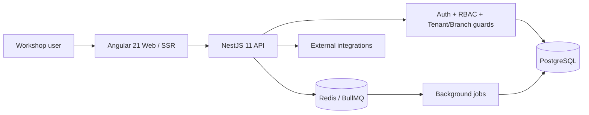

# MOTORIX / TecnoAuto — Sanitized SaaS Engineering Case Study

> **Source repository:** private  
> **Public artifact type:** sanitized architecture / engineering evidence  
> **Domain:** automotive workshop management SaaS  
> **Evidence basis:** current private repository metadata, architecture documentation and security/RBAC audit records  
> **Future direction:** [Product Vision Roadmap](./ROADMAP.md) — explicitly not current implementation evidence

This case study documents engineering work from the private MOTORIX/TecnoAuto product without publishing commercial source code, production credentials, customer records or deployment secrets.

## Problem space

MOTORIX is a multi-tenant ERP/SaaS product focused on automotive workshops and related automotive service businesses. The product models operational workflows such as customers, vehicles, work orders, inventory, invoicing, branches, users and tenant-level module access.

The engineering problem is broader than CRUD: each request and UI capability must respect company/tenant boundaries, branch context, role/permission rules and product entitlements while remaining usable across multiple automotive verticals.

## Verified technology profile

The current private source includes:

- Angular 21 frontend with SSR support
- TypeScript 5.x
- NestJS 11 backend
- TypeORM 0.3
- PostgreSQL
- JWT + bcrypt authentication primitives
- role/permission guards
- BullMQ + Redis integration
- WebSockets / Socket.IO
- Swagger/OpenAPI tooling
- Docker/infrastructure/runbook assets
- Jest/Supertest backend testing infrastructure
- Angular/Jasmine testing infrastructure

`Angular` · `NestJS` · `TypeScript` · `PostgreSQL` · `TypeORM` · `BullMQ` · `Redis` · `JWT` · `RBAC` · `SSR` · `Docker`

## Architecture snapshot



## Multi-tenant and branch boundaries

The private product treats tenant isolation as an explicit security property rather than a UI convention. Reviewed architecture/audit documentation covers:

- tenant/company-scoped backend access
- cross-tenant restrictions for ordinary users
- branch-aware access controls
- role-based access control
- granular permission checks
- separate handling for super-admin/global operations
- endpoint and frontend-route RBAC reviews

Security audits found and corrected tenant-isolation defects during development and also documented remaining areas requiring validation. This public case study intentionally preserves that distinction: audited/corrected does not mean every path is assumed safe without evidence.

## Authorization model

A representative backend request passes through multiple authorization concerns:

```text
Authenticated user
    ↓
Global role / privileged cross-tenant rule
    ↓
Tenant/company boundary
    ↓
Branch boundary
    ↓
Granular permission requirement
    ↓
Domain operation
```

The frontend also contains permission-aware guards/services, but UI visibility is treated as UX assistance rather than the security boundary; backend authorization remains authoritative.

## Product architecture themes

### Automotive domain modularity

The private product contains automotive-oriented modules and vertical concepts rather than attempting to become a generic ERP for unrelated industries. Examples include workshop operations, lubricator/service workflows, car wash/detailing and parts/inventory-oriented use cases.

### Multi-branch operations

Branch context is propagated through the application so businesses can scope operational data and permissions beyond the tenant/company level.

### SaaS entitlements

The architecture includes module/entitlement concepts so product capabilities can be enabled per organization instead of relying only on hardcoded menus.

### Background and integration workloads

The NestJS backend includes BullMQ/Redis dependencies and worker-oriented scripts for asynchronous tasks. External integrations and fiscal workflows are isolated from ordinary synchronous CRUD paths where appropriate.

## Security engineering evidence

Private documentation includes dedicated material for:

- tenant-isolation audits
- RBAC endpoint matrices
- security hardening
- secret/configuration handling
- audit-log sanitization
- production/preproduction checklists
- rate-limit expectations
- migration and go-live procedures

A recorded audit describes the backend tenant-isolation posture as largely correct after two critical issues were corrected, while explicitly retaining follow-up gaps. That is more meaningful portfolio evidence than a blanket “secure” claim.

## Reproducibility and database governance

The product uses TypeORM migrations and contains database validation/migration tooling. Production-oriented documentation separates migration operations, preproduction checks and application startup concerns rather than treating schema changes as ad-hoc manual SQL.

## Quality evidence

The current private backend defines separate commands for:

- build
- lint
- Jest tests
- coverage
- E2E tests
- load tests
- smoke checks
- TypeORM migrations
- database checks

The current Angular frontend includes unit-test infrastructure and versioned specs for application/guard behavior.

This public artifact does not invent a global pass count where a single current canonical count has not been verified. Test/build capabilities are listed only where their configuration or versioned evidence exists.

## Current engineering boundary

MOTORIX is stronger as a portfolio case study when its limits are explicit:

- source remains private
- production/customer data is not public
- deployment endpoints and credentials are not published here
- not every historical audit gap is represented as closed
- fiscal/third-party integrations are not demonstrated with real credentials
- public screenshots, when added, must use synthetic/demo data

## What this project demonstrates

MOTORIX is evidence of work on a product where **multi-tenancy, RBAC, branch scoping, domain modeling, SaaS entitlements, migrations and operational hardening** interact in the same codebase.

It is particularly relevant to enterprise/full-stack roles because the engineering work extends beyond frontend implementation into authorization, persistence, deployment discipline and security review.

## Future product direction

The public [Product Vision Roadmap](./ROADMAP.md) describes `NEXT / LATER / EXPLORE` outcomes separately from current evidence. It includes workshop-flow hardening, customer/parts/payment lifecycle expansion and bounded intelligent-workshop exploration without presenting those items as implemented today.

---

Public portfolio: [Francisco Quinteros / JavierQuinan](https://github.com/JavierQuinan)  
Repository publication policy: [Portfolio Governance](../../docs/PORTFOLIO_GOVERNANCE.md)
