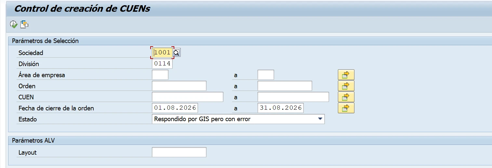
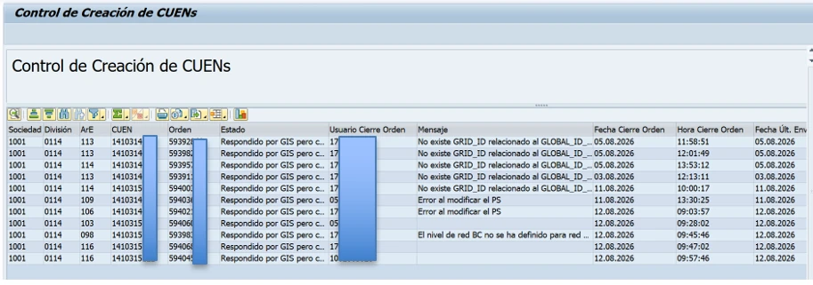
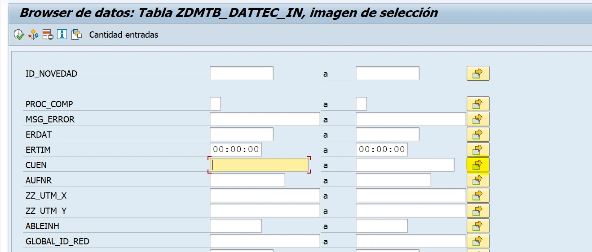
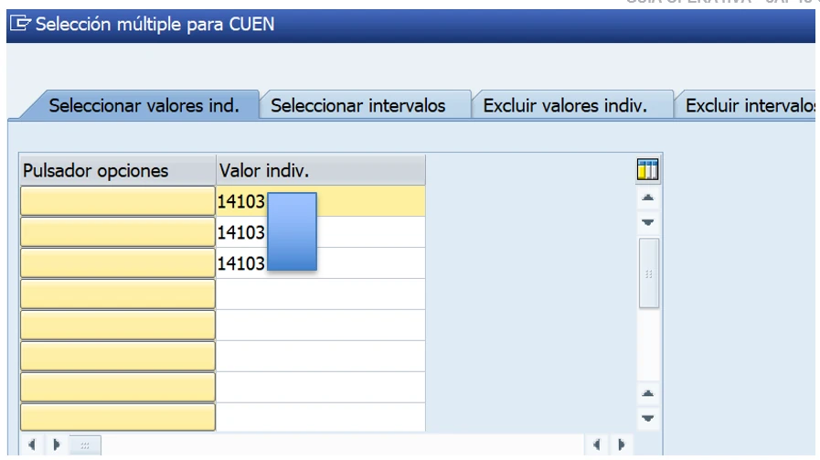
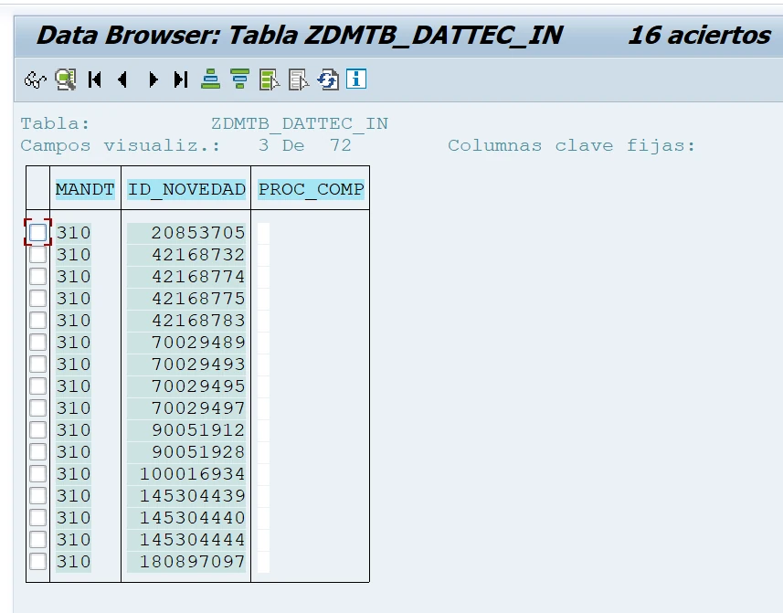
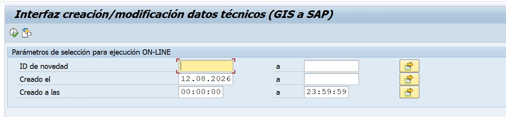
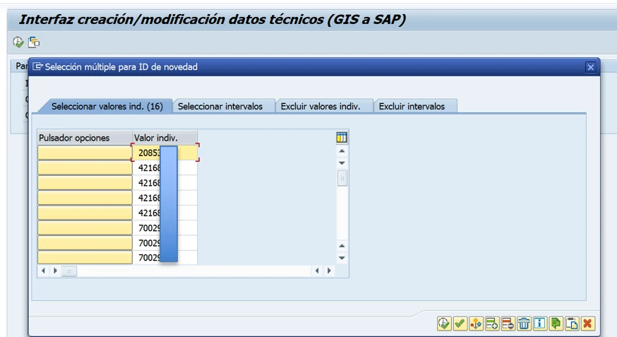
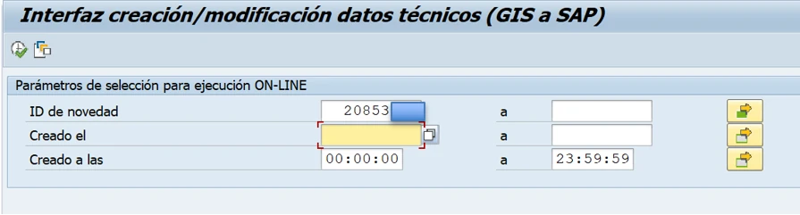
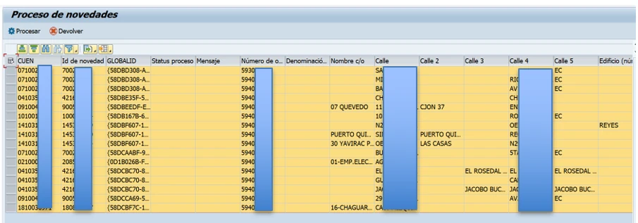
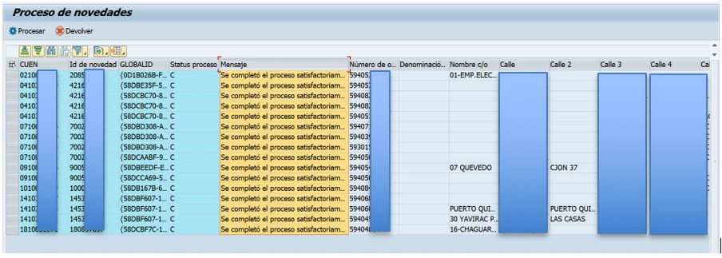

# Monitoreo y reproceso de CUEN

Control de creación de CUEN e interfaz GIS–SAP

# 1. Objetivo

Verificar diariamente que no existan CUEN bloqueados, pendientes de creación o con errores subsanables, y reprocesar los casos que correspondan para completar correctamente la creación del CUEN y permitir la continuidad de los procesos contractuales.

# 2. Alcance y criterio de tratamiento

El monitoreo se ejecuta por sociedad y división. Deben revisarse las diez empresas eléctricas; para CNEL, el control se realiza individualmente sobre sus once unidades de negocio (divisiones).

| Resultado observado | Acción |
|---|---|
| La columna Mensaje contiene un error funcional o de datos. | No reprocesar directamente. La corrección corresponde a la empresa eléctrica responsable del caso. |
| La columna Mensaje está vacía. | Incluir el CUEN en el reproceso descrito en esta guía. |
| El mensaje indica que el registro está bloqueado por un usuario. | Incluir el caso en el tratamiento diario y verificar que el bloqueo haya sido liberado antes de reprocesar. |

**Resultado esperado:** Los CUEN seleccionados deben finalizar con estado de proceso completado y con el mensaje de ejecución satisfactoria.

# 3. Procedimiento

**Paso 1. Ejecutar el monitor de creación de CUEN**

Ingrese a la transacción ZMONICUEN.

**Paso 2. Completar los parámetros de selección**

Ingrese la sociedad, la división y el período que se va a revisar. En cada ejecución cambie la sociedad y la división hasta completar el monitoreo de todas las empresas eléctricas y, en el caso de CNEL, de sus once divisiones. Seleccione el estado «Respondido por GIS pero con error» y ejecute la consulta.

**Paso 3. Clasificar los resultados**

Revise la columna Mensaje y aplique el criterio de tratamiento indicado en la sección 2. Copie únicamente los CUEN que deban ser reprocesados: registros sin mensaje y casos bloqueados que ya se encuentren liberados.

**Importante:** Los registros con un error funcional o de datos informado en la columna Mensaje deben ser corregidos por la empresa eléctrica correspondiente antes de cualquier reproceso.

**Paso 4. Consultar los CUEN en la tabla técnica**

Abra una nueva ventana e ingrese a la transacción SE16. Consulte la tabla ZDMTB_DATTEC_IN y ubique el campo CUEN.

**Paso 5. Obtener los identificadores de novedad**

Ingrese los CUEN identificados. Si existen varios registros, utilice Selección múltiple, pegue un CUEN por fila, confirme la selección y ejecute la consulta.

Copie el valor del campo ID_NOVEDAD correspondiente a cada CUEN. Estos identificadores se utilizarán para ejecutar el reproceso en la interfaz GIS–SAP.

**Paso 6. Ingresar los ID_NOVEDAD en la interfaz GIS–SAP**

Acceda a la transacción ZGISDMT. En el campo ID de novedad, utilice Selección múltiple para cargar todos los valores obtenidos en el paso anterior.

**Paso 7. Ejecutar la consulta sin restricción de fecha**

Elimine el valor del campo Creado el. Mantenga los ID de novedad cargados y ejecute la consulta.

**Paso 8. Procesar y validar**

Seleccione todos los registros recuperados y pulse Procesar. Espere a que el sistema finalice la ejecución.

# 4. Validación final

Confirme que la columna Status proceso muestre el estado completado y que la columna Mensaje indique «Se completó el proceso satisfactoriamente». Con esta validación se confirma que el CUEN fue creado o reprocesado correctamente.

**Cierre del monitoreo:** Si un registro mantiene un error luego del reproceso, documente el CUEN, el ID_NOVEDAD y el mensaje obtenido para su análisis y escalamiento.
