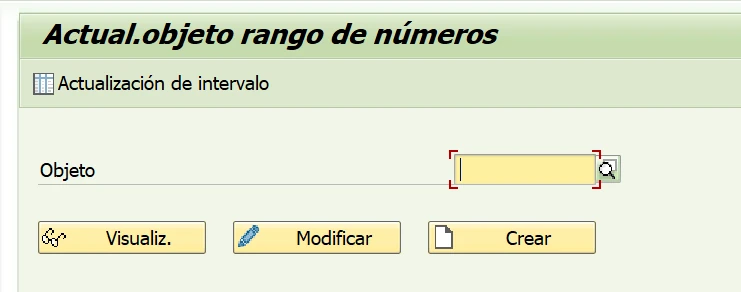
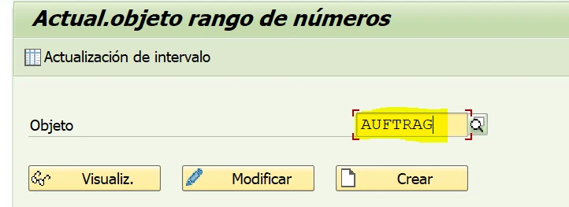
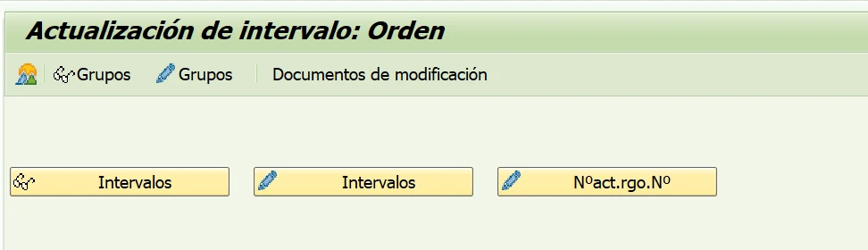
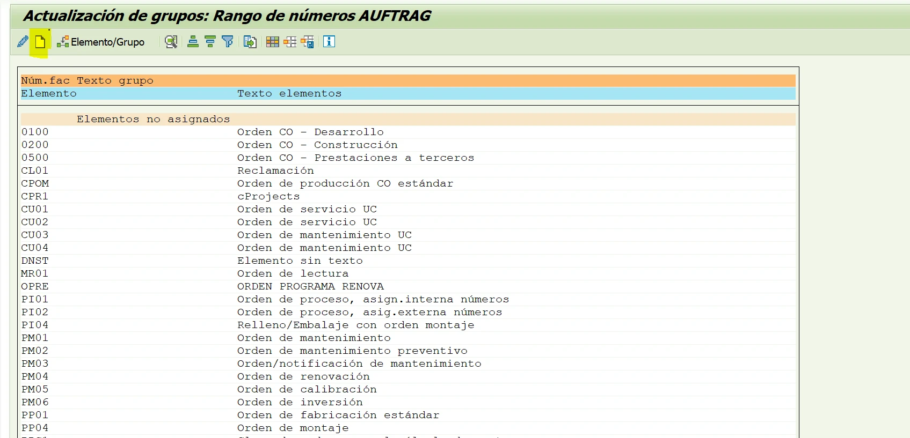
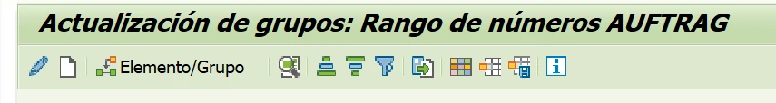
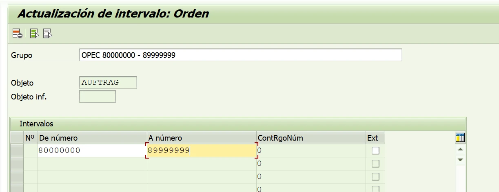
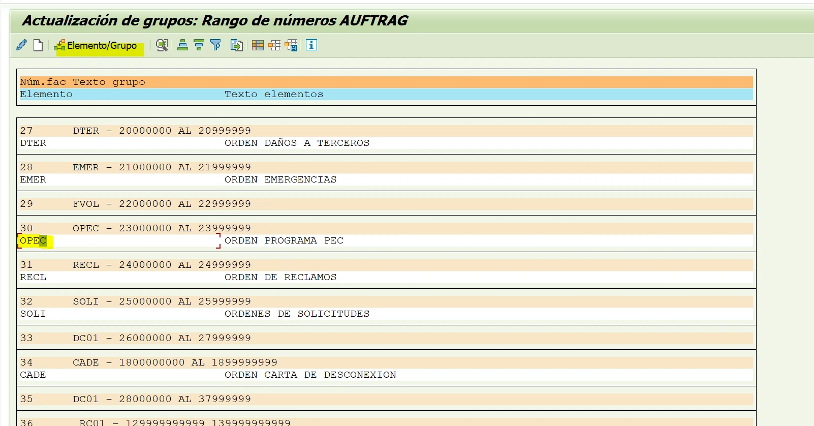
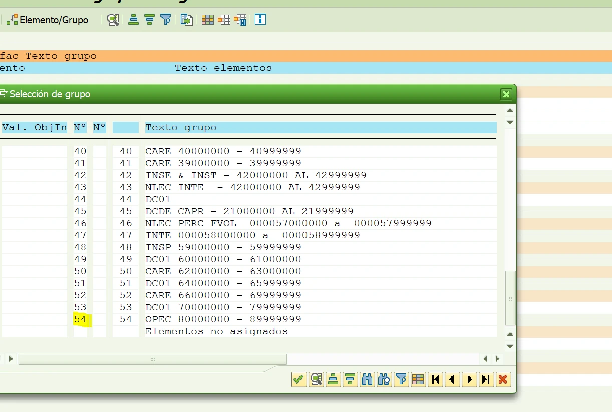

**Ampliación del rango de numeración de órdenes**

Configuración del objeto de rango AUFTRAG mediante la transacción SNRO

# 1. Objetivo

Configurar o ampliar un intervalo de numeración para órdenes en SAP mediante el objeto AUFTRAG, garantizando que el nuevo rango no se superponga con intervalos existentes y que quede asociado al grupo de órdenes correcto.

# 2. Consideraciones previas

Esta actividad modifica la asignación de números de órdenes. Antes de realizarla, confirme el tipo o grupo de orden que requiere ampliación, el rango solicitado, el ambiente donde se ejecutará y la autorización funcional correspondiente.

| Validación | Criterio |
|---|---|
| Objeto | Utilizar AUFTRAG, correspondiente al rango de números de órdenes. |
| Solapamiento | El valor inicial y el valor final no deben coincidir ni cruzarse con otro intervalo existente. |
| Grupo | El intervalo debe quedar asignado al grupo o tipo de orden solicitado. |
| Longitud | Mantener la longitud y el formato numérico utilizados por los rangos existentes. |
| Evidencia | Registrar los valores anteriores y posteriores para facilitar la trazabilidad del cambio. |

**Ejemplo documentado:** En las capturas se configura el grupo OPEC con el intervalo 80000000–89999999. En la lista de grupos, esta asignación aparece como grupo 54.

**Precaución:** No modifique ni elimine intervalos existentes si el requerimiento consiste únicamente en crear o ampliar un rango. Un cambio incorrecto puede provocar duplicidad, agotamiento o interrupción en la creación de órdenes.

# 3. Procedimiento

**Paso 1. Ingresar a la transacción SNRO**

Ejecute la transacción SNRO. El sistema mostrará la pantalla de mantenimiento de objetos de rango de números.

**Paso 2. Seleccionar el objeto AUFTRAG**

En el campo Objeto, ingrese AUFTRAG. Verifique que el valor sea correcto antes de continuar, debido a que este objeto administra la numeración de órdenes.

Damos clic en “Actualización de intervalo”.

**Paso 3. Acceder a la actualización de intervalos**

Ingrese en Actualización de intervalo. En la pantalla siguiente se presentan las opciones para consultar o modificar grupos e intervalos del objeto AUFTRAG.

**Paso 4. Revisar los grupos existentes**

Seleccione Grupos con el ícono de lápiz. Revise la relación de elementos y grupos existentes para identificar el grupo correcto y evitar crear una asignación duplicada.

**Paso 5. Crear un nuevo grupo**

Pulse el ícono de hoja en blanco (Nuevo). Registre el código o denominación del grupo conforme al requerimiento funcional. Para el ejemplo mostrado, el grupo corresponde a OPEC.

**Paso 6. Definir el intervalo numérico**

En la actualización del intervalo, complete los campos De número y A número. Para el ejemplo OPEC se registra 80000000 como valor inicial y 89999999 como valor final. No seleccione Ext., ya que el ejemplo corresponde a numeración interna.

**Control obligatorio:** Antes de guardar, compare el intervalo contra todos los grupos existentes. Los extremos del nuevo rango tampoco pueden estar contenidos dentro de otro intervalo.

**Paso 7. Guardar la configuración**

Confirme los datos ingresados y utilice Guardar. Atienda el mensaje emitido por SAP y, cuando corresponda, registre la orden de transporte o solicitud de cambio definida para el ambiente.

**Paso 8. Verificar la asignación del grupo**

Regrese al listado de grupos y localice el registro creado. Compruebe el número de grupo, el código, el rango inicial y el rango final.

# 4. Validación final

La configuración se considera correcta cuando el grupo aparece en la lista con el código solicitado, el rango coincide con los valores aprobados y no existe superposición con otros intervalos. Como prueba funcional, debe verificarse en el ambiente correspondiente que la creación de una orden del tipo asociado utilice la numeración prevista.

**Resultado esperado:** El grupo OPEC queda registrado como grupo 54 y asociado al intervalo interno 80000000–89999999, sin afectar los demás rangos del objeto AUFTRAG.

# 5. Datos que deben quedar documentados

- Fecha y ambiente de ejecución.
- Objeto de rango: AUFTRAG.
- Grupo o tipo de orden afectado.
- Rango anterior, cuando aplique, y rango configurado.
- Usuario responsable y solicitud que autorizó el cambio.
- Resultado de la validación y evidencia del registro final.
