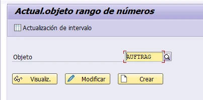
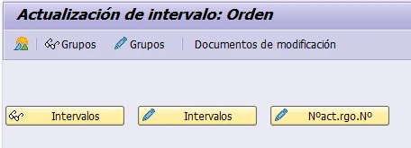
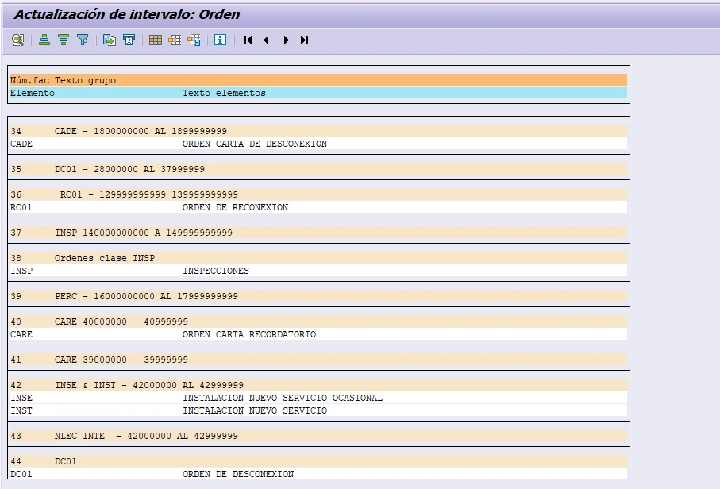
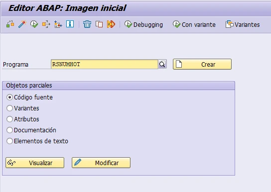
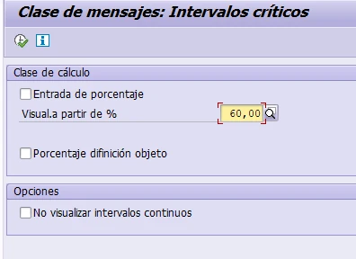
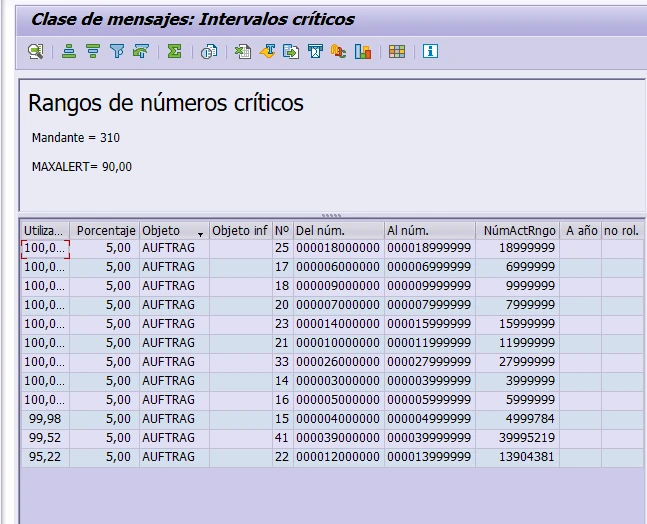

# MONITOREO DE RANGOS DE ÓRDENES DE TRABAJO

**Objetivo:** identificar oportunamente los intervalos próximos a agotarse para evitar interrupciones en la generación de órdenes de trabajo.

## 1. Consulta de intervalos — transacción SNRO/SNUM

Ingrese el objeto AUFTRAG y seleccione «Actualización de intervalo».

Revise las opciones disponibles e identifique los grupos e intervalos correspondientes a cada tipo de orden.

## 2. Monitoreo de consumo — transacción SE38

Ingrese a la transacción SE38 y ejecute el programa RSNUMHOT. Este reporte permite consultar el porcentaje de utilización de los intervalos y detectar los rangos próximos a agotarse.

Digite RSNUMHOT y presione Enter para continuar.

Desmarque los criterios que no correspondan, establezca 60 % en el campo «Visualizar a partir de %» y ejecute el reporte. En el resultado, filtre por el objeto AUFTRAG y priorice los intervalos con mayor porcentaje de utilización.

## 3. Ampliación del rango al alcanzar el 100 %

**Acción inmediata.** Un intervalo agotado puede impedir la creación de nuevas órdenes asociadas. La ampliación debe ejecutarse sobre el intervalo y grupo correctos, previa verificación de que el nuevo espacio numérico esté disponible.

**Paso 1. Identifique el intervalo agotado.** Ejecute RSNUMHOT, filtre por AUFTRAG y registre el número de intervalo, el grupo, el límite superior y el número actual. Confirme que la utilización sea 100 % o que el número actual haya alcanzado el límite.

**Paso 2. Ingrese a SNRO o SNUM.** Consulte el objeto AUFTRAG, seleccione «Actualización de intervalo» y active el modo de modificación.

**Paso 3. Defina el nuevo espacio numérico.** Amplíe el valor «Hasta número» del intervalo existente únicamente si el tramo consecutivo está libre. Si el diseño funcional exige un intervalo nuevo, créelo con límites «Desde número» y «Hasta número» que no se superpongan con ningún rango existente, y asígnelo al grupo correspondiente.

**Paso 4. Guarde y documente el cambio.** Registre el objeto, grupo, intervalo, valores anterior y nuevo, fecha, responsable y autorización. Revise también los documentos de modificación disponibles en la pantalla.

**Paso 5. Valide la operación.** Ejecute nuevamente RSNUMHOT y confirme que el intervalo dispone de capacidad. Luego, valide con el equipo funcional la creación controlada de una orden del tipo afectado.

**Validaciones obligatorias:** no modificar manualmente el número actual; no reutilizar números; no crear intervalos solapados; confirmar el mandante y el ambiente; y verificar si el mantenimiento debe realizarse directamente en cada ambiente, ya que los rangos de números pueden no transportarse automáticamente.

**Recomendación preventiva:** no espere al 100 %. Configure el monitoreo periódico y gestione la ampliación desde el umbral interno definido por el equipo —por ejemplo, entre 80 % y 90 %— para evitar indisponibilidad operativa.
