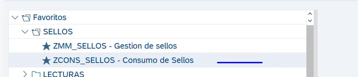
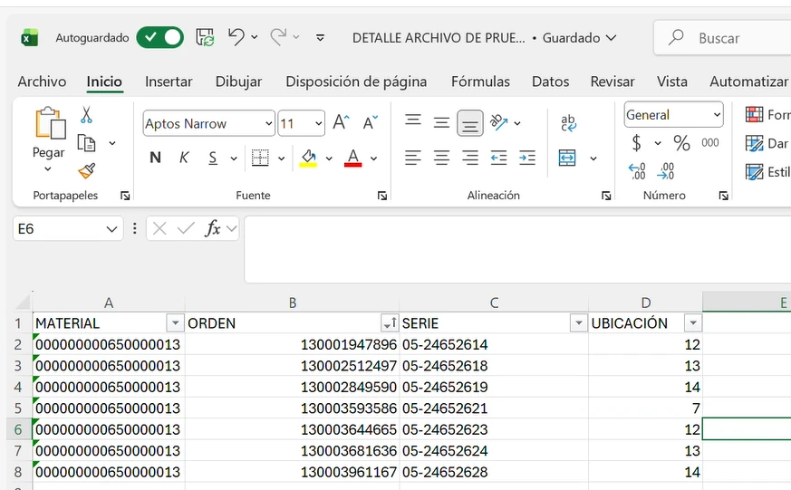

**ZCONS_SELLOS: Consumo de sellos**

**Estructura del archivo Excel**

El archivo de carga debe conservar la estructura indicada, con las columnas MATERIAL, ORDEN, SERIE y UBICACIÓN.

**Ampliación del período contable en ambientes de prueba**

En los ambientes de pruebas y réplica, el período contable puede ampliarse mediante la transacción MMPV.

