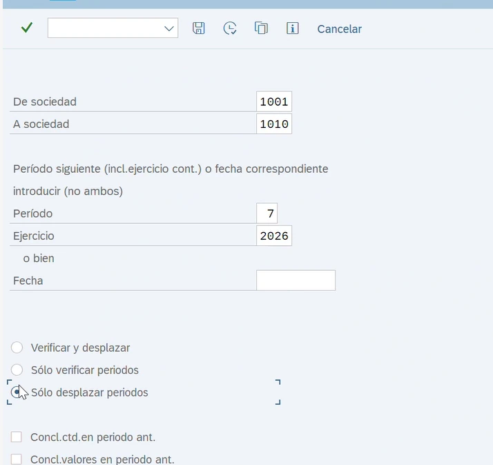

# SAP ECC MM ↔ IS-U/WM — Habilitación y Consumo de Sellos

[English version](./README.md)

> **Tipo de evidencia:** caso operativo cross-module  
> **Estado:** `FUNCTIONAL_EVIDENCE_READY`  
> **Alcance:** disponibilidad de material → gestión de sellos → consumo en OT → soporte de ambiente de prueba

Esta evidencia documenta la relación entre SAP MM, Seal Management y Work Management, complementada con la guía operativa aportada para `ZCONS_SELLOS` y el uso de `MMPV` en ambientes de prueba y réplica.

## Guía evidencial aportada

- [ZCONS_SELLOS: Consumo de sellos](./CONSUMO_SELLOS_GUIDE.es.md)

La estructura de carga documentada utiliza las columnas `MATERIAL`, `ORDEN`, `SERIE` y `UBICACIÓN`.

### Evidencia MMPV



La captura corresponde a la guía entregada y documenta la ampliación del período contable en ambientes de prueba mediante `MMPV`.

## Relación del proceso

```text
Necesidad de material para campo
          │
          ▼
Material creado/extendido en SAP MM
          │
          ▼
Habilitar/configurar en Seal Management
          │
          ▼
Disponibilizar tipo de sello para WM
          │
          ▼
Uso en OT / ejecución de campo
          │
          ▼
ZCONS_SELLOS / consumo según proceso
```

## Principio de troubleshooting

Que un material exista en contexto `MM01/MM03` no significa automáticamente que todas las aplicaciones downstream puedan utilizarlo.

Cuando un material no aparece en un flujo de campo/sellos, validar dos capas:

1. **MM** — material existente y correctamente extendido/configurado para el contexto organizativo requerido.
2. **Seal/WM** — categoría/tipo/configuración correspondiente disponible para el proceso de OT.

## Checklist diagnóstico

- ¿Existe el material?
- ¿Está extendido al centro/almacén requerido?
- ¿Corresponde al proceso de gestión de sellos?
- ¿La configuración de sellos reconoce/referencia el material?
- ¿La categoría/tipo de sello está activa?
- ¿La OT expone esa opción de material/sello?
- ¿El proceso downstream de consumo/movimiento reconoce el material seleccionado?

## Insight cross-module

```text
Disponibilidad en maestro MM
        ≠
Disponibilidad en aplicación WM
```

## Qué demuestra

- integración SAP MM ↔ IS-U/WM;
- gestión y consumo de sellos mediante proceso operativo;
- estructura de archivo de carga para `ZCONS_SELLOS`;
- uso de `MMPV` en ambientes de prueba/réplica;
- troubleshooting de habilitación de materiales de campo.
