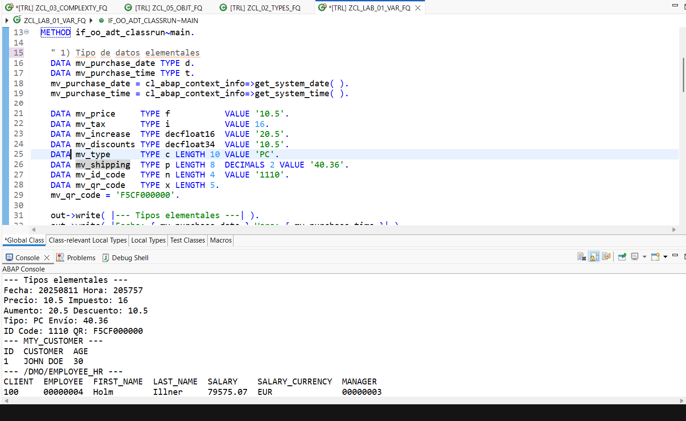

# Lab 01 — Variables and Data Types

[Versión en español](./README.es.md)

## Status

`HISTORICAL_EXECUTION_VERIFIED`

## Provenance

Curso 1 (Logali Group), Unit 2 — "Conceptos básicos." Personal Word submission (`Francisco Quinteros_Conceptos Básicos.docx`) confirmed as the account owner's own document via its `docProps/core.xml` authorship metadata. The embedded screenshot below is the account owner's own Eclipse ADT capture from that document.

## Object

[`ZCL_LAB_01_VAR_FQ`](../source/zcl_lab_01_var_fq.abap)

## What this demonstrates

Elementary and structured data types, a Dictionary-backed read from a standard demo table, generic/binary data objects, constants, and inline (`DATA(...)`) declarations, executed as an ABAP Cloud console class (`if_oo_adt_classrun`).

## Evidence

Eclipse ADT showing the class source and its ABAP Console output. The bottom connection status bar (system ID, client, tenant hostname fragment, account identifier) has been redacted; source code and console output are unmodified.

## Sanitization

One redaction applied: the ADT status bar (private BTP trial account identifier and tenant hostname fragment). No other part of the image was altered.
