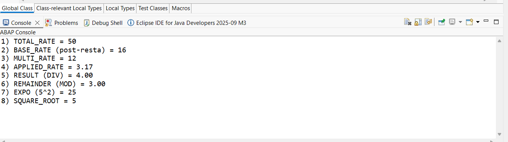

# Lab 02 — Operaciones Aritméticas

[English version](./README.md)

## Estado

`HISTORICAL_EXECUTION_VERIFIED`

## Procedencia

Curso 1 (Logali Group), Unidad 3 — "Cálculos y operaciones numéricas." Entrega personal en Word (`Laboratorio - Cálculos y operaciones numéricas.docx`), autoría confirmada vía `docProps/core.xml`. La captura embebida es la propia captura de Eclipse ADT del propietario.

## Objeto

[`ZCL_LAB_02_ARITHMETIC_FQ`](../source/zcl_lab_02_arithmetic_fq.abap)

## Qué demuestra esto

Sentencias `ADD`/`SUBTRACT`/`MULTIPLY`/`DIVIDE`, división entera (`DIV`), resto (`MOD`), exponenciación, y `sqrt( )`, ejecutado como una clase de consola ABAP Cloud.

## Evidencia

Salida de la Consola de Eclipse ADT. No aparecen datos sensibles en esta captura (resultados puramente numéricos).

## Sanitización

Ninguna requerida — no hay datos identificables presentes en esta imagen.
