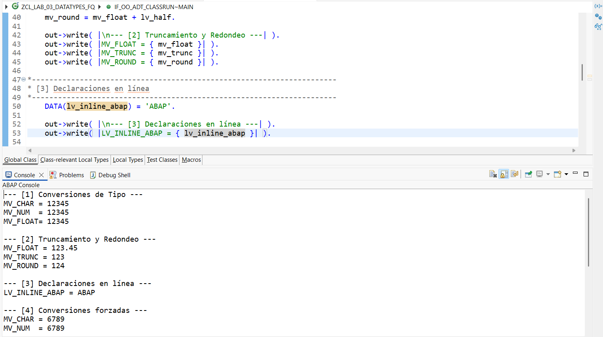
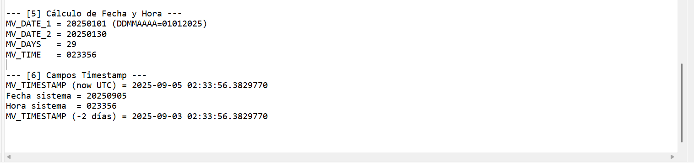

# Lab 03 — Data Type Conversions

[Versión en español](./README.es.md)

## Status

`HISTORICAL_EXECUTION_VERIFIED`

## Provenance

Curso 1 (Logali Group), Unit 4 — "Uso y Conversiones Tipos de datos." Personal Word submission (`Uso y Conversiones Tipos de datos.docx`), authorship confirmed via `docProps/core.xml`. The embedded screenshots are the account owner's own Eclipse ADT captures.

## Object

[`ZCL_LAB_03_DATATYPES_FQ`](../source/zcl_lab_03_datatypes_fq.abap)

## What this demonstrates

Type conversions, truncation/rounding, inline declarations, forced conversion (`CONV`), date/time arithmetic, and `utclong` timestamp handling, executed as an ABAP Cloud console class.

## Evidence

Eclipse ADT source and console output, split across two captures. The date/time/UTC-timestamp values shown reflect the system clock at the moment of the original 2025 execution — they are expected to differ from the current date and are not personally-identifying data.

## Sanitization

None required — no identifying data present in either image.
