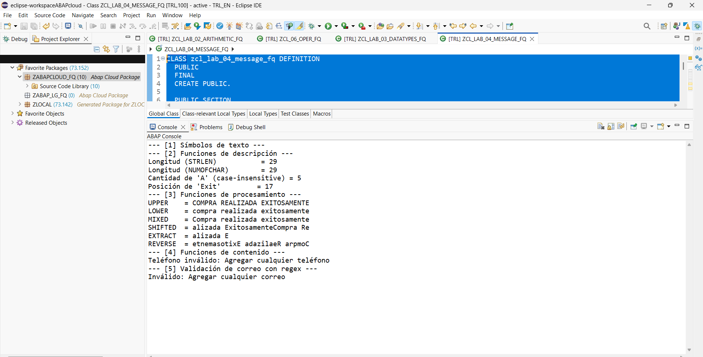

# Lab 04 — Text Field Processing

[Versión en español](./README.es.md)

## Status

`HISTORICAL_EXECUTION_VERIFIED`

## Provenance

Curso 1 (Logali Group), Unit 5 — "Procesamiento Campos de Texto." Personal Word submission (`Procesamiento Campos de Texto.docx`), authorship confirmed via `docProps/core.xml`. The embedded screenshot is the account owner's own Eclipse ADT capture.

## Object

[`ZCL_LAB_04_MESSAGE_FQ`](../source/zcl_lab_04_message_fq.abap)

## What this demonstrates

An ABAP text-pool symbol (`TEXT-001`), string-description functions (`STRLEN`/`NUMOFCHAR`/`COUNT`/`FIND`), case-conversion functions, and regex validation (`contains( regex = )`), executed as an ABAP Cloud console class in the documented historical practice. `TEXT-001` is part of that original class context.

## Evidence

Eclipse ADT source and console output. The regex-validation lines print "invalid" for the literal placeholder strings already present in the historical source (`'Agregar cualquier teléfono'` / `'Agregar cualquier correo'`) — this is the source's own literal content, not a real phone number or email.

## Sanitization

One redaction applied: the Project Explorer's root connection node (private BTP trial account identifier). All other content, including the console output, is unmodified.
