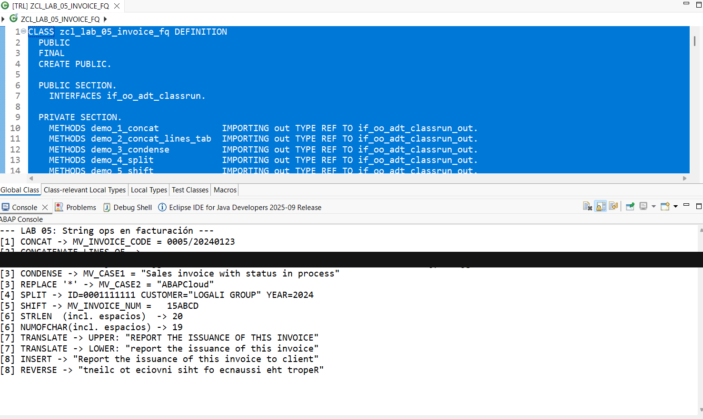

# Lab 05 — Operaciones con Strings (Parte I)

[English version](./README.md)

## Estado

`HISTORICAL_EXECUTION_VERIFIED`

## Procedencia

Curso 1 (Logali Group), Unidad 6 — "Operaciones con cadenas de caracteres." Entrega personal en Word (`06 Laboratorio - Operaciones con cadenas de caracteres_Francisco Quinteros.docx`), autoría confirmada vía `docProps/core.xml`. La captura embebida es la propia captura de Eclipse ADT del propietario.

## Objeto

[`ZCL_LAB_05_INVOICE_FQ`](../source/zcl_lab_05_invoice_fq.abap)

## Qué demuestra

`CONCATENATE`, `CONCATENATE LINES OF`, `CONDENSE`, `REPLACE`, `SPLIT`, `SHIFT`, `STRLEN`/`NUMOFCHAR`, `TRANSLATE`, inserción de string-template y `REVERSE`, ejecutado como una clase de consola ABAP Cloud en la práctica histórica documentada. Un método (`demo_2_concat_lines_tab`) lee la tabla `ZEMP_LOGALI` específica del curso; esa dependencia forma parte del contexto histórico preservado del source.

## Evidencia

Source y salida de consola de Eclipse ADT.

## Sanitización

Una redacción aplicada: la línea de salida `[2] CONCATENATE LINES OF`, que contenía datos de registro de `ZEMP_LOGALI` del entorno de formación (nombres y direcciones de email de apariencia sintética suministrados por el curso, no datos propios del propietario). El resto del contenido no fue modificado.
