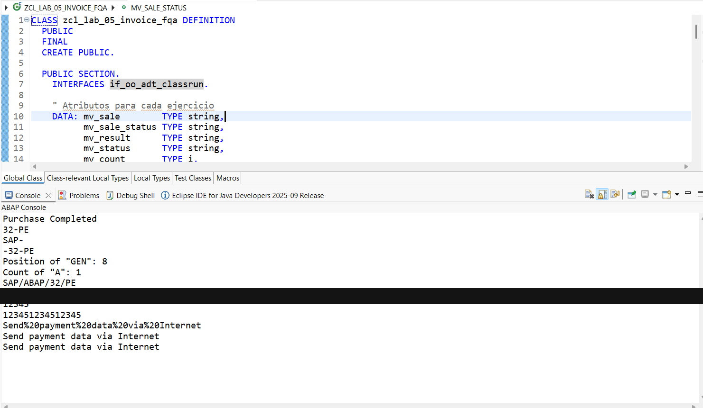

# Lab 05a — Operaciones con Strings (Parte II)

[English version](./README.md)

## Estado

`HISTORICAL_EXECUTION_VERIFIED`

## Procedencia

Curso 1 (Logali Group), Unidad 7 — "Operaciones con cadenas de caracteres II." Entrega personal en Word (`07 Laboratorio - Operaciones con cadenas de caracteres II_FRANCISCO QUINTEROS.docx`), autoría confirmada vía `docProps/core.xml`. La captura embebida es la propia captura de Eclipse ADT del propietario.

## Objeto

[`ZCL_LAB_05_INVOICE_FQA`](../source/zcl_lab_05_invoice_fqa.abap)

## Qué demuestra esto

`OVERLAY`, `substring`/`substring_before`/`substring_after`, `FIND` con offset, `REPLACE`, validación regex, `REPLACE REGEX` (eliminación de ceros a la izquierda), `repeat( )`, y `escape( )` (formatos URL/JSON/string-template), ejecutado como una clase de consola ABAP Cloud. Totalmente autocontenida — sin dependencia de tabla u objeto externo.

## Evidencia

Source y salida de consola de Eclipse ADT.

## Sanitización

Una redacción aplicada: una línea de consola "Valid email: ..." que mostraba una dirección específica del entorno de formación (dominio `@logali.com`) generada en runtime, distinta del propio literal del fuente histórico (`learner@example.com`, en sí mismo un valor sintético — no redactado, ya que no es una dirección real). El resto del contenido no fue modificado.
