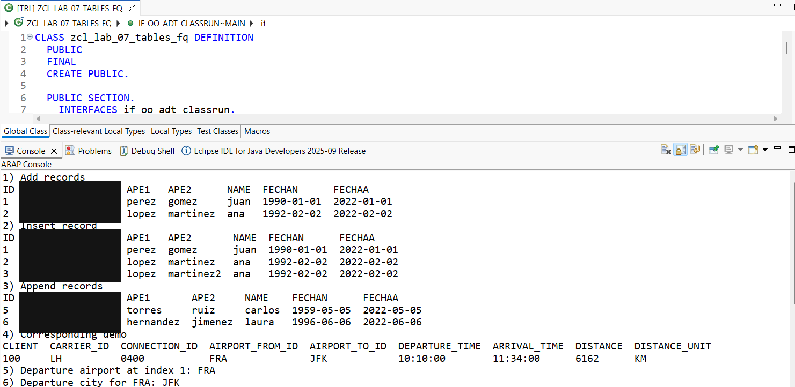
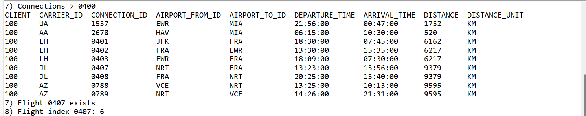
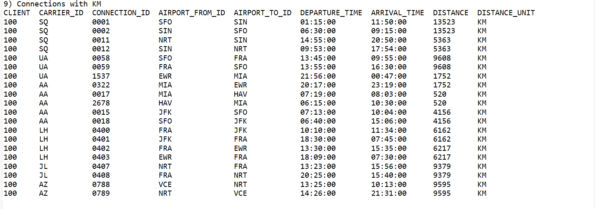

# Lab 07 — Internal Tables (Part I)

[Versión en español](./README.es.md)

## Status

`HISTORICAL_EXECUTION_VERIFIED`

## Provenance

Curso 1 (Logali Group), Unit 10 — "Tablas Internas Parte I." Personal Word submission (`FRANCISCO JAVIER QUINTEROS ANDRADE.docx`), authorship confirmed via `docProps/core.xml`. The embedded screenshots are the account owner's own Eclipse ADT captures.

## Object

[`ZCL_LAB_07_TABLES_FQ`](../source/zcl_lab_07_tables_fq.abap)

## What this demonstrates

`VALUE` constructor, `INSERT INTO TABLE`, `APPEND` (single/`VALUE`/`LINES OF`), `MOVE-CORRESPONDING`, `READ TABLE` (index/key), `line_exists( )`, and `line_index( )`, against the class's own synthetic employee records and the standard SAP Flight Reference Scenario demo table `/DMO/CONNECTION`, executed as an ABAP Cloud console class. Self-contained — no course-specific table dependency.

## Evidence

Eclipse ADT source and console output, split across three captures.

## Sanitization

One redaction applied: the `EMAIL` column across the "Add records" / "Insert record" / "Append records" output tables in the first capture, which showed training-environment `@logali.com`-domain addresses (the historical source's own synthetic employee literals — the published `.abap` file already uses the sanitized `@example.invalid` domain for these same values). The `/DMO/CONNECTION` demo-data tables in the second and third captures required no changes.
