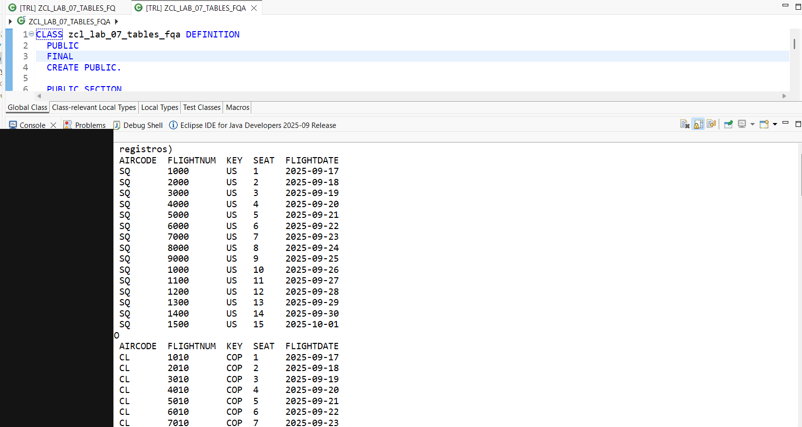
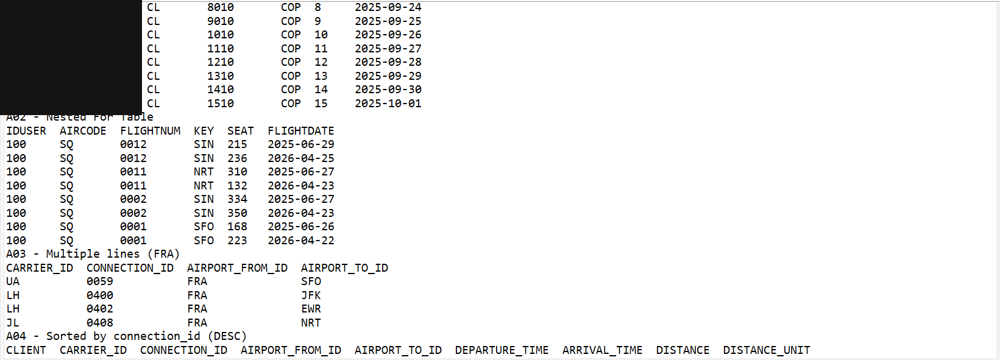
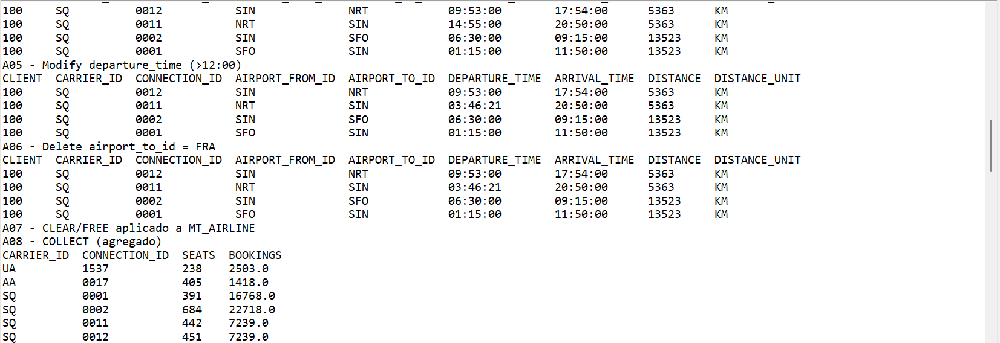
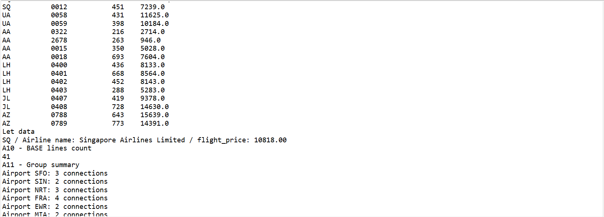
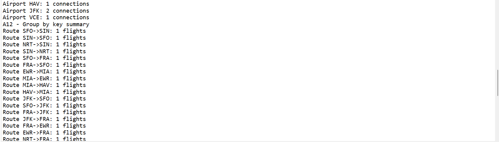
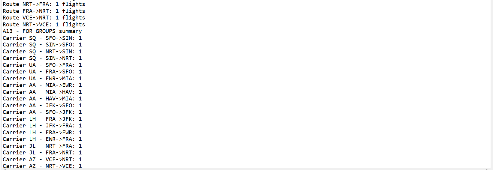
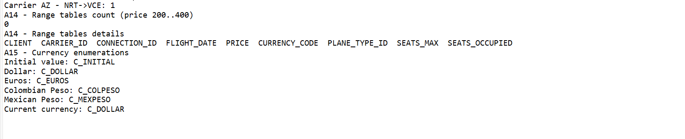

# Lab 07a — Tablas Internas (Parte II, Avanzado)

[English version](./README.md)

## Estado

`HISTORICAL_EXECUTION_VERIFIED`

## Procedencia

Curso 1 (Logali Group), Unidad 11 — "Tablas Internas Parte II." Entrega personal en Word (`LAB_11_FRANCISCO QUINTEROS.docx`), autoría confirmada vía `docProps/core.xml`. Las capturas embebidas son las propias capturas de Eclipse ADT del propietario.

## Objeto

[`ZCL_LAB_07_TABLES_FQA`](../source/zcl_lab_07_tables_fqa.abap)

## Qué demuestra esto

15 actividades numeradas contra las tablas de demostración estándar del SAP Flight Reference Scenario (`/DMO/FLIGHT`, `/DMO/CONNECTION`, `/DMO/CARRIER`): expresiones `FOR`, `FOR` anidado, `SELECT` multi-línea, `SORT`, `MODIFY`, `DELETE`, `CLEAR`/`FREE`, `COLLECT`, `LET`, `BASE`, tres variantes de `GROUP BY`, tablas `RANGE`, y tipos `ENUM` — ejecutado como una clase de consola ABAP Cloud.

## Evidencia

Source y salida de consola de Eclipse ADT, dividido en siete capturas, cubriendo las 15 actividades (`A01`–`A15`).

## Sanitización

Una redacción aplicada, a través de las dos primeras capturas: la columna `IDUSER` de las tablas de salida `A01 - LT_FLIGHTS`/`LT_FLIGHTS_INFO`. `add_flights_with_for( )` llama a `cl_abap_context_info=>get_user_technical_name( )` e incrusta el nombre de usuario técnico SAP real del propietario (concatenado con un identificador privado de cuenta trial de BTP) en esa columna en runtime — este valor no está fijado en el fuente, pero la captura resultante es un dato real, actual, e identificable personalmente, y fue redactado. El resto de columnas y capturas no fueron modificadas.
