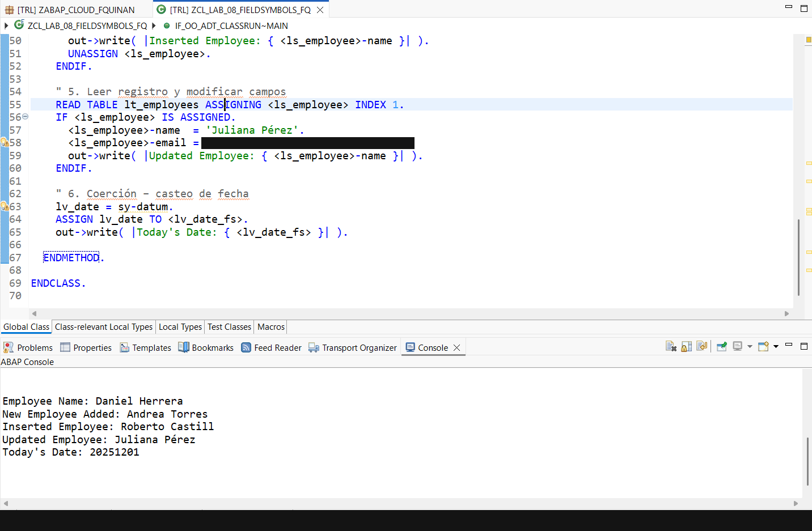

# Lab 08 — Field Symbols

[Versión en español](./README.es.md)

## Status

`HISTORICAL_EXECUTION_VERIFIED`

## Provenance

Curso 1 (Logali Group), Unit 13 — "Field Symbol - Punteros." Personal Word submission (`Francisco Quinteros Andrade.docx`), authorship confirmed via `docProps/core.xml`. The embedded screenshot is the account owner's own Eclipse ADT capture.

## Object

[`ZCL_LAB_08_FIELDSYMBOLS_FQ`](../source/zcl_lab_08_fieldsymbols_fq.abap)

## What this demonstrates

`ASSIGN` to a variable, `ASSIGN` to a table line while looping, `APPEND`/`INSERT ... ASSIGNING`, `READ TABLE ... ASSIGNING`, and a date-field coercion cast, executed as an ABAP Cloud console class in the documented historical practice. The class uses the training-specific `ZEMP_LOGALI` table as a compile-time field-symbol type; that dependency is part of the preserved historical source context.

## Evidence

Eclipse ADT source and console output.

## Sanitization

Two redactions applied: (1) the ADT connection status bar (private BTP trial account identifier and tenant hostname fragment); (2) one source-code line assigning a training-environment-specific email literal (a real-looking third-party domain used only as exercise data, not the account owner's own data or a domain otherwise reproduced in the published `.abap` source). All other content, including the console output, is unmodified.
