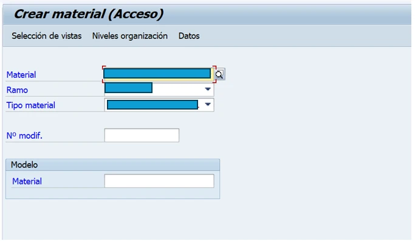
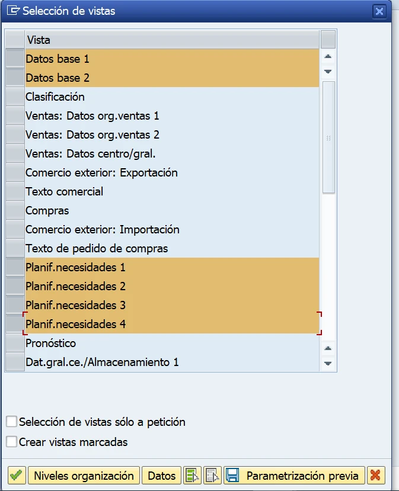
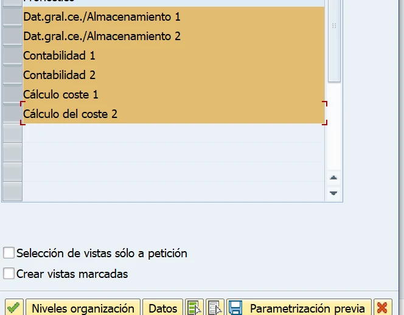
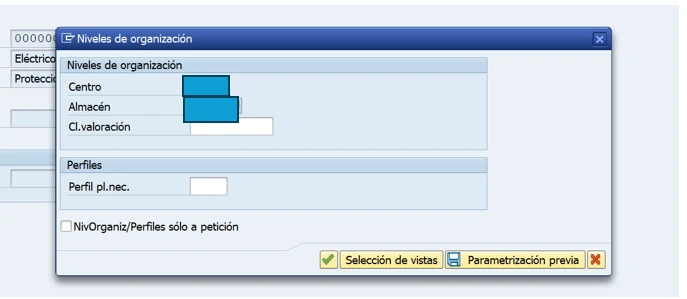
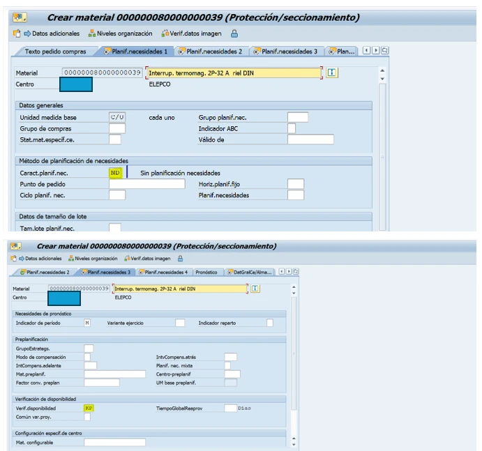
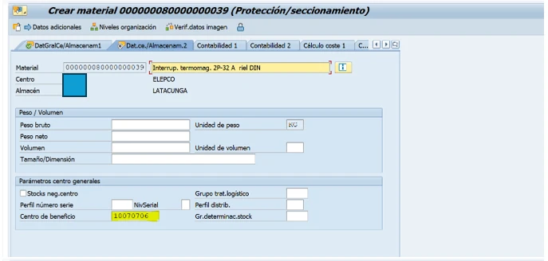
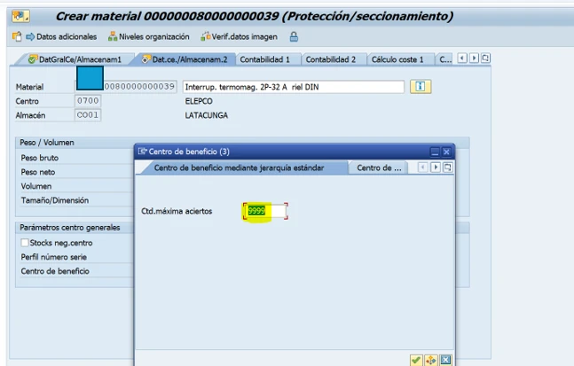
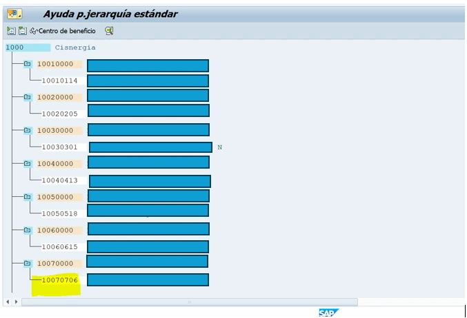
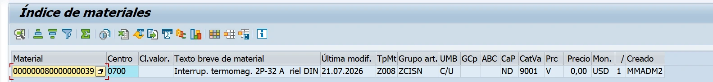

**GUÍA DE EXTENSIÓN DE MATERIAL – MM01**

*Ticket 15797 | Centro SAP 0700*

**Objetivo:** extender el material indicado al centro SAP 0700, con el fin de habilitar su ingreso en el almacén general de ELEPCO.

**Material:** 000000080000000039 – Interruptor termomagnético de 32 A, 2 polos, unipolar.

Antes de iniciar, verifique que el material exista en SAP y confirme si ya se encuentra extendido al centro y al almacén de la empresa solicitante. Según el resultado, proceda con la creación del material o únicamente con su extensión.

En este caso, el material ya existe en SAP; por tanto, corresponde realizar únicamente la extensión al centro 0700.

**1. Acceder a la transacción MM01**

Ingrese el número de material, seleccione el ramo y el tipo de material; luego, presione Enter.

**2. Seleccionar las vistas requeridas**

**3. Ingresar los niveles organizativos**

**4. Completar los datos de la extensión**  
Presione Enter y complete los campos obligatorios correspondientes a las vistas seleccionadas.

**En el campo señalado, sustituya el valor 999 por 1000.**

**5. Verificar la extensión del material**

**Resultado esperado: el material debe constar habilitado para el centro 0700 y el almacén general de la empresa solicitante.**
