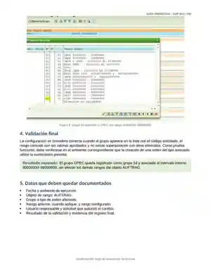

# SAP ECC IS-U / WM — Gobierno de Rangos de Numeración de Órdenes

[English version](./README.md)

> **Tipo de evidencia:** parametrización operativa + monitoreo preventivo  
> **Objeto estándar:** `AUFTRAG`  
> **Transacciones / reportes:** `SNRO` / `SNUM` · `SE38` · `RSNUMHOT`

Esta evidencia consolida dos actividades reales y complementarias: monitoreo de consumo de rangos de órdenes y mantenimiento controlado del objeto de rango `AUFTRAG` cuando existe riesgo de agotamiento.

## Guías evidenciales aportadas

- [Ampliación del rango de numeración de órdenes](./AMPLIACION_RANGO_GUIDE.es.md)
- [Monitoreo de rangos de órdenes de trabajo](./MONITOREO_RANGOS_GUIDE.es.md)



La evidencia visual corresponde a la guía entregada para este caso y muestra la verificación final del grupo y del intervalo configurado.

## Flujo operativo demostrado

```text
RSNUMHOT
   │
   ▼
identificar intervalos críticos
   │
   ▼
filtrar objeto AUFTRAG
   │
   ▼
registrar intervalo / grupo / utilización
   │
   ▼
SNRO / SNUM
   │
   ▼
actualización de intervalo
   │
   ▼
validar no solapamiento
   │
   ▼
guardar + documentar cambio
   │
   ▼
revalidar capacidad con RSNUMHOT
```

## Monitoreo preventivo con `RSNUMHOT`

El reporte estándar permite identificar intervalos próximos a agotarse. El procedimiento documentado utiliza `SE38`, ejecuta `RSNUMHOT`, define un umbral de visualización y filtra los resultados por `AUFTRAG`.

Controles relevantes:

- priorizar intervalos con mayor porcentaje de utilización;
- no esperar al agotamiento total si existe un umbral preventivo interno;
- registrar número de intervalo, grupo, límite superior y número actual antes de cualquier cambio;
- confirmar ambiente y mandante antes de mantener el rango.

## Mantenimiento con `SNRO` / `SNUM`

Para el objeto `AUFTRAG`, la evidencia muestra acceso a **Actualización de intervalo**, revisión de grupos y mantenimiento del espacio numérico.

Reglas de seguridad funcional:

1. verificar que el tramo nuevo esté libre;
2. no reutilizar números ya consumidos;
3. no modificar manualmente el número actual;
4. no crear intervalos superpuestos;
5. mantener formato y longitud compatibles con la configuración existente;
6. asociar el intervalo al grupo funcional correcto;
7. conservar trazabilidad anterior/posterior del cambio.

## Validación posterior

Después del mantenimiento:

- volver a ejecutar `RSNUMHOT`;
- confirmar que el intervalo dispone de capacidad;
- revisar nuevamente la asignación del grupo;
- validar de forma controlada la creación de una orden del tipo asociado cuando el procedimiento de cambio lo requiera.

## Nota sobre transporte

Los rangos de números requieren una validación específica por ambiente. La guía operativa fuente advierte que el mantenimiento puede no propagarse como una parametrización transportable ordinaria, por lo que debe confirmarse el procedimiento técnico aplicable en cada landscape.

## Qué demuestra

- parametrización SAP de rangos de numeración;
- administración del objeto `AUFTRAG`;
- monitoreo preventivo de capacidad;
- análisis de riesgo operativo por agotamiento;
- control de solapamientos;
- trazabilidad de cambios;
- validación posterior a parametrización.
