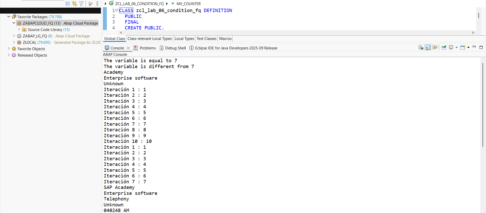
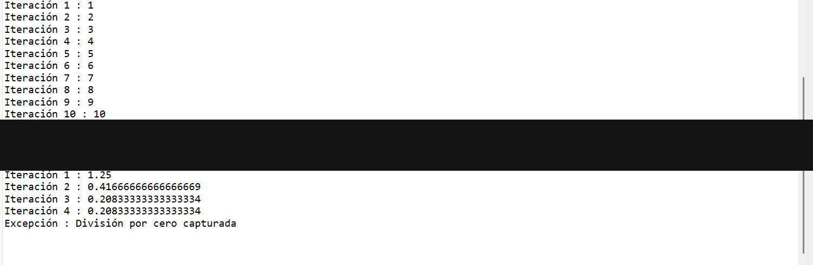

# Lab 06 — Estructuras de Control

[English version](./README.md)

## Estado

`HISTORICAL_EXECUTION_VERIFIED`

## Procedencia

Curso 1 (Logali Group), Unidad 8 — "Estructuras de control." Entrega personal en Word (`08 Laboratorio - Estructuras de control_FRANCISCO QUINTEROS ANDRADE.docx`), autoría confirmada vía `docProps/core.xml`. Las capturas embebidas son las propias capturas de Eclipse ADT del propietario.

## Objeto

[`ZCL_LAB_06_CONDITION_FQ`](../source/zcl_lab_06_condition_fq.abap)

## Qué demuestra esto

`IF`/`ENDIF`, `CASE`/`ENDCASE`, `DO`/`ENDDO`, `CHECK`, `SWITCH`, `COND`, `WHILE`/`ENDWHILE`, `LOOP`/`ENDLOOP`, y `TRY`/`ENDTRY` con una excepción real (`CX_SY_ZERODIVIDE`), ejecutado como una clase de consola ABAP Cloud. Esta clase usa la tabla `ZEMP_LOGALI` específica del curso como TYPE DDIC en tiempo de compilación — ver la [referencia opcional de runtime-readiness](../../runtime-readiness/README.es.md) para un reemplazo sintético `_fq` que elimina esta dependencia.

## Evidencia

Source y salida de consola de Eclipse ADT, dividido en dos capturas.

## Sanitización

Dos redacciones aplicadas: (1) el nodo raíz de conexión del Project Explorer (identificador privado de cuenta trial de BTP) en la primera captura; (2) cuatro líneas de salida de `LOOP AT` mostrando direcciones de email de `ZEMP_LOGALI` del entorno de formación en la segunda captura. El resto del contenido no fue modificado.
