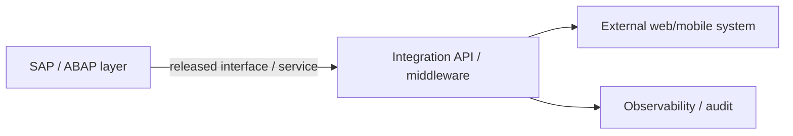

# SAP Integration Lab — Public Evidence Roadmap

> **Artifact type:** public engineering-evidence roadmap  
> **Current status:** in construction  
> **Public ABAP source currently available:** none  
> **Purpose:** convert enterprise SAP experience and ABAP/ABAP Cloud study into reproducible, non-confidential technical evidence

This is intentionally **not presented as a completed SAP/ABAP case study**. A review of the current GitHub account found no dedicated SAP repository and no indexed ABAP source suitable for public portfolio evidence.

The objective of this lab is to build that evidence correctly without publishing employer/client configuration, screenshots, production data or proprietary SAP artifacts.

## Positioning boundary

The public profile currently separates two different things:

1. **Functional/operational SAP experience** — enterprise process support, configuration analysis and integration troubleshooting.
2. **Technical ABAP / ABAP Cloud specialization** — an active learning and evidence-building track.

This lab exists to make the second category independently verifiable through code and reproducible exercises instead of relying on profile claims.

## Target evidence areas

### SAP MM

Planned public exercises should demonstrate technical understanding around materials/service-oriented processes without reproducing customer configuration.

Potential evidence:

- synthetic material/service master examples
- purchase-order/reporting scenarios
- validation/report utilities
- service-procurement examples
- document-flow analysis using synthetic datasets

### SAP IS-U / Work Management

Production/customer workflows must remain private. Public evidence should instead use abstracted examples and diagrams covering concepts such as:

- work-order lifecycle
- status/event handling
- operational integration boundaries
- CRM ↔ IS-U process interaction
- external-system integration patterns

No real installation, contract, business-partner, meter or customer identifiers should be included.

### ABAP fundamentals

First executable evidence set:

```text
01-abap-core/
├── reports/
├── internal-tables/
├── modularization/
├── exceptions/
└── unit-tests/
```

Expected artifacts:

- typed data structures
- internal tables and expressions
- Open SQL over synthetic/demo tables where legally available
- modularized reports/classes
- exception handling
- ABAP Unit examples

### ABAP Objects

```text
02-abap-oo/
├── classes/
├── interfaces/
├── dependency-injection/
└── abap-unit/
```

Evidence gate:

- interfaces instead of monolithic procedural examples
- testable classes
- explicit error contracts
- ABAP Unit coverage for business rules

### ABAP Cloud / RAP

```text
03-abap-cloud/
├── cds/
├── behavior-definitions/
├── behavior-implementations/
├── service-definitions/
└── tests/
```

Target evidence:

- released-API discipline
- CDS view entities
- RAP business objects
- behavior definitions/implementations
- service exposure
- authorization concepts
- ABAP Unit / test doubles where applicable

No claim of ABAP Cloud proficiency will be upgraded in the public portfolio until executable artifacts exist here or in a dedicated repository.

## Integration-focused track

The lab should eventually connect SAP concepts with the software-engineering stack demonstrated elsewhere in this portfolio.



Planned sanitized patterns:

- SAP-facing REST/OData consumer examples
- SOAP/XML transformation exercises
- idempotent integration handling
- correlation/audit IDs
- retry/error mapping
- secure secret/configuration separation

## Evidence acceptance gate

An artifact only counts as public SAP technical evidence when it satisfies all of the following:

1. Code is executable or independently reviewable.
2. README explains scenario, assumptions and expected result.
3. No employer/customer code or configuration is copied.
4. All business data is synthetic.
5. No SAP credentials, RFC destinations, hostnames or internal endpoints are published.
6. Tests or deterministic validation are included where technically possible.
7. Screenshots contain only demo/synthetic systems and no confidential identifiers.
8. The profile claim matches exactly what the artifact proves.

## Current status matrix

| Area | Enterprise experience evidence | Public code evidence | Portfolio status |
|---|---|---|---|
| SAP MM | Profile-level functional experience | Not yet published | Functional experience only |
| SAP IS-U Work Management | Profile-level functional experience | Not yet published | Functional experience only |
| SAP CRM / IS-U integration | Profile-level operational experience | Not yet published | Functional/integration experience only |
| ABAP | Study/specialization track | Not yet published | In progress |
| ABAP Cloud / RAP | Study/specialization track | Not yet published | In progress |

## First implementation milestone

The next promotion step is to publish a small but high-quality ABAP evidence pack rather than a large collection of copied tutorials. The first milestone should contain approximately five focused exercises:

1. ABAP report + internal-table transformations
2. ABAP OO service class + interface
3. Open SQL/query example with synthetic/demo source
4. ABAP Unit test suite
5. first ABAP Cloud/RAP artifact when an appropriate development environment is available

After that evidence exists, this roadmap can evolve into a real `SAP Integration Lab` repository or case study.

---

Public portfolio: [Francisco Quinteros / JavierQuinan](https://github.com/JavierQuinan)  
Repository publication policy: [Portfolio Governance](../../docs/PORTFOLIO_GOVERNANCE.md)
