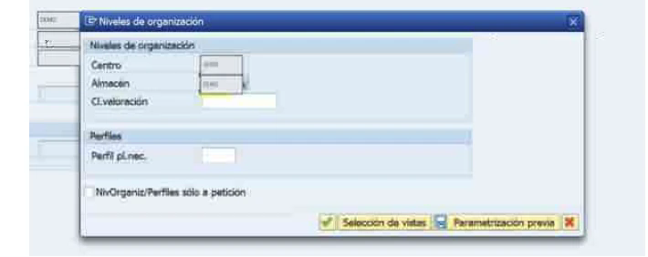

# SAP ECC MM — Evidencia Visual de Extensión de Material con MM01

[English version](./README.md)

> **Tipo de evidencia:** capturas operativas originales aportadas como evidencia + guía reproducible  
> **Fuente:** guía de trabajo utilizada para documentar un caso real de extensión de material

Este set documenta el patrón operativo para extender un material existente a niveles organizativos adicionales mediante `MM01`.

Las imágenes publicadas en este apartado se muestran como fueron aportadas en la guía de trabajo. No se aplican bloques de color, desenfoque adicional ni sustitución visual que degrade la evidencia.

## Evidencia disponible

### Niveles organizativos



Demuestra la selección de centro, el contexto de almacén y la asignación del nivel organizativo antes de mantener las vistas seleccionadas.

### Verificación posterior


Demuestra la comprobación posterior de que el material se encuentra disponible en el contexto organizativo esperado.

## Flujo operativo documentado

```text
Confirmar que el material ya existe
        ↓
Verificar si la extensión requerida ya existe
        ↓
MM01
        ↓
Seleccionar las vistas requeridas
        ↓
Ingresar Centro + Almacén
        ↓
Mantener los campos requeridos
        ↓
Guardar
        ↓
Verificar el material en el nivel organizativo esperado
```

## Controles prácticos

- No crear un material duplicado si la necesidad es únicamente una extensión organizativa.
- Confirmar centro y almacén destino antes de guardar.
- Seleccionar únicamente las vistas necesarias para el proceso y alcance autorizado.
- Verificar el resultado después del guardado.

## Referencias oficiales SAP

- [Extending a Material Master Record — SAP Help](https://help.sap.com/docs/SAP_S4HANA_ON-PREMISE/f7fddfe4caca43dd967ac4c9ce6a70e4/e614c453f57eb44ce10000000a174cb4.html)
- [Storage-Location-Specific Data — SAP Help](https://help.sap.com/docs/SAP_S4HANA_ON-PREMISE/f7fddfe4caca43dd967ac4c9ce6a70e4/cc52bf53f106b44ce10000000a174cb4.html)

## Qué demuestra

- experiencia práctica con `MM01`;
- extensión organizativa de material existente;
- selección de niveles organizativos;
- validación posterior del resultado;
- documentación operativa basada en evidencia visual real.
