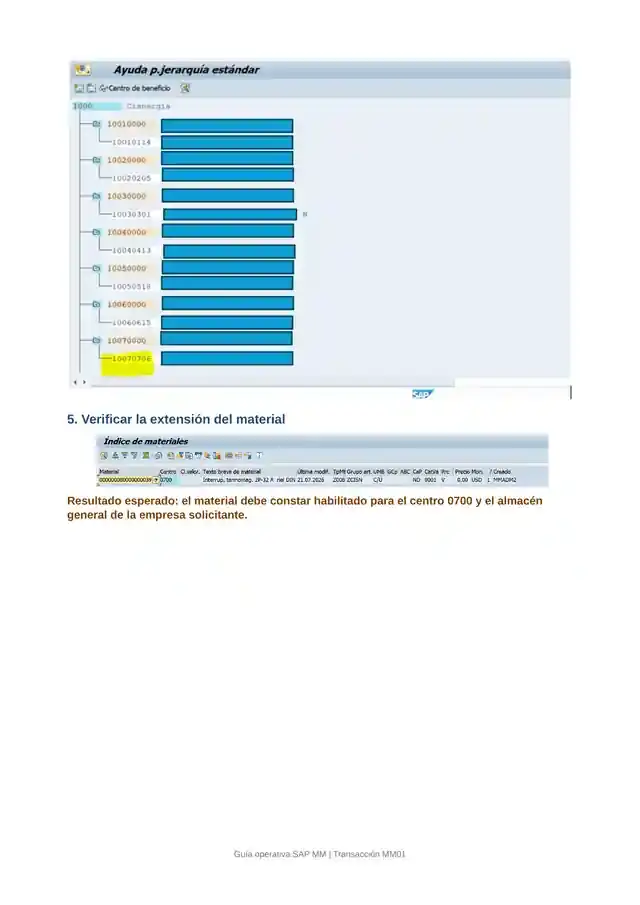

# SAP ECC MM — Evidencia Visual de Extensión de Material con MM01

[English version](./README.md)

> **Tipo de evidencia:** guía operativa y evidencia visual aportadas para el portafolio  
> **Transacción:** `MM01`

Este set documenta la extensión de un material existente al centro/almacén requerido mediante `MM01`, siguiendo la guía entregada.

## Guía evidencial

- [Guía de extensión de material — MM01](./GUIDE.es.md)

## Evidencia visual



La captura corresponde a la validación final incluida en la guía aportada: el material queda disponible en el contexto organizativo requerido.

## Flujo operativo documentado

```text
Confirmar que el material ya existe
        ↓
Verificar si la extensión requerida ya existe
        ↓
MM01
        ↓
Seleccionar las vistas requeridas
        ↓
Ingresar Centro + Almacén
        ↓
Mantener los campos requeridos
        ↓
Guardar
        ↓
Verificar el material en el nivel organizativo esperado
```

## Referencias oficiales SAP

- [Extending a Material Master Record — SAP Help](https://help.sap.com/docs/SAP_S4HANA_ON-PREMISE/f7fddfe4caca43dd967ac4c9ce6a70e4/e614c453f57eb44ce10000000a174cb4.html)
- [Storage-Location-Specific Data — SAP Help](https://help.sap.com/docs/SAP_S4HANA_ON-PREMISE/f7fddfe4caca43dd967ac4c9ce6a70e4/cc52bf53f106b44ce10000000a174cb4.html)

## Qué demuestra

- experiencia práctica con `MM01`;
- extensión organizativa de material existente;
- selección de niveles organizativos;
- validación posterior del resultado;
- documentación operativa basada en evidencia visual real.
